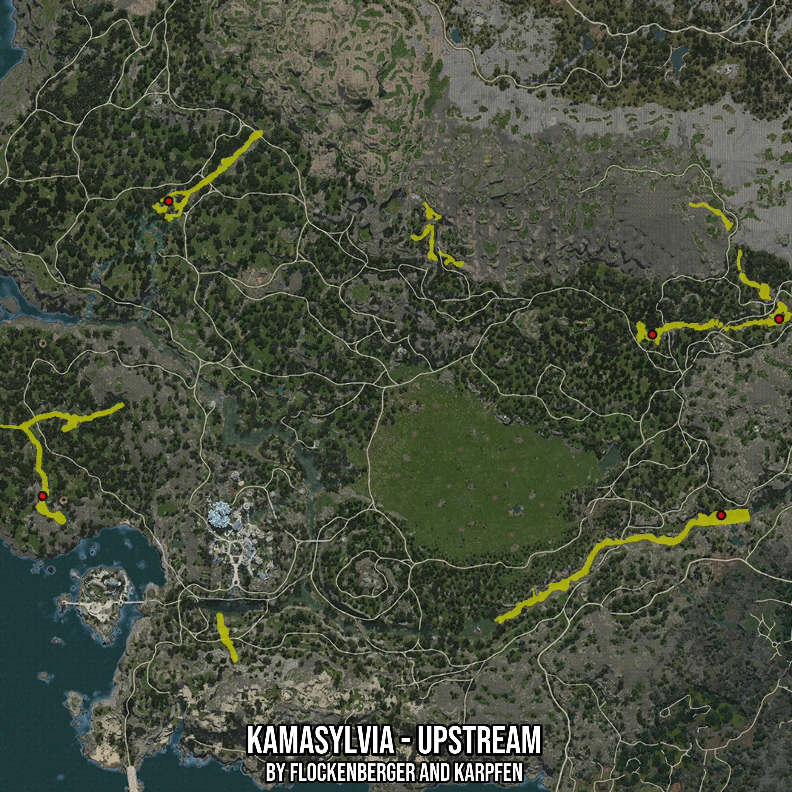

# Kamasylvia - Upstream
Created by **flockenberger**

- **Red Points**: Exact in-game waypoints.
- **Colored Areas**: Entire area where the fishing table is consistent.
## ⚠️ Info about your float:
To verify your fishing position without modifying your files, you can do so [here](https://flockenberger.github.io/bdo-fish-position/).
- Or watch the guide [here](https://youtu.be/t-VXcRoNojk)

## Waypoints
Below you'll find the Copy-Paste ready XML file for this Fishing-Zone.

```xml
	<!--
		Waypoints for: Kamasylvia - Upstream
		Auto-Generated by: flockenberger
		Preview at: https://github.com/Flockenberger/bdo-fish-waypoints/tree/main/Bookmark/Kamasylvia%20-%20Upstream
	-->
	<WorldmapBookMark>
		<BookMark BookMarkName="1: Kamasylvia - Upstream" PosX="-308103.49538326263" PosY="0.0" PosZ="-445138.8722896576" />
		<BookMark BookMarkName="2: Kamasylvia - Upstream" PosX="-583981.1478376389" PosY="-8175.0" PosZ="-437308.2839012146" />
		<BookMark BookMarkName="3: Kamasylvia - Upstream" PosX="-532781.1468362808" PosY="0.0" PosZ="-317440.0462627411" />
		<BookMark BookMarkName="4: Kamasylvia - Upstream" PosX="-336112.90769577026" PosY="0.0" PosZ="-371651.8120288849" />
		<BookMark BookMarkName="5: Kamasylvia - Upstream" PosX="-284611.73021793365" PosY="0.0" PosZ="-365327.1060228348" />
	</WorldmapBookMark>
```

## Usage Guide
[](https://youtu.be/W-bWmKdv8K8)

## Previews
     

 