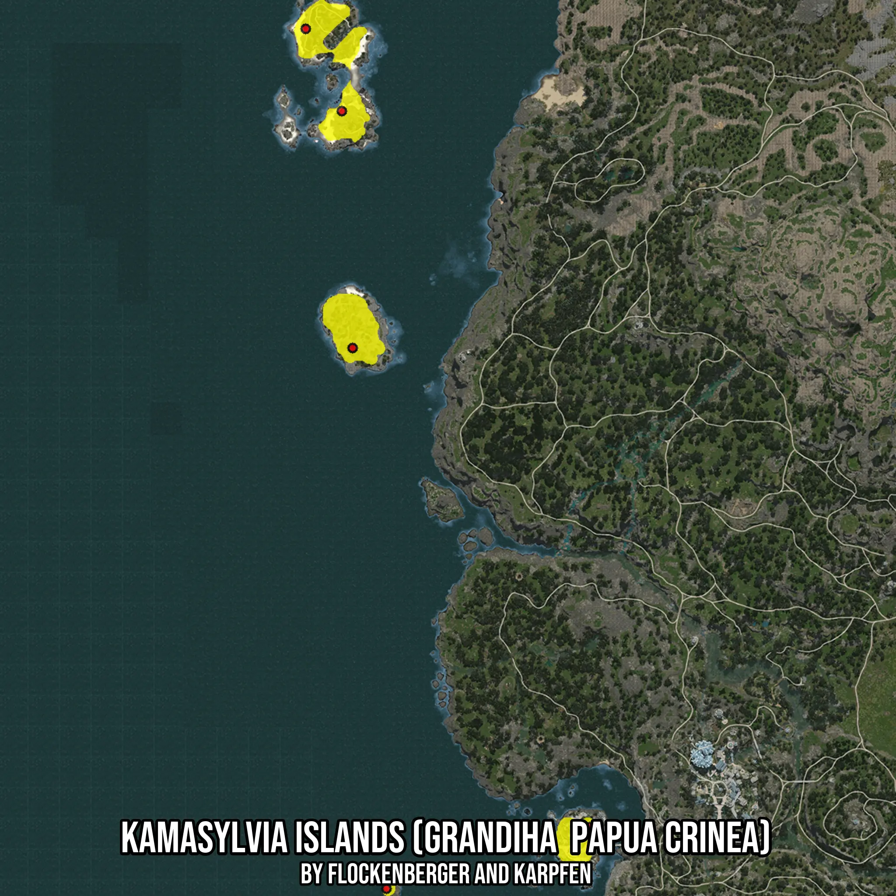

# Kamasylvia Islands (Grandiha  Papua Crinea)
Created by **flockenberger**

- **Red Points**: Exact in-game waypoints.
- **Colored Areas**: Entire area where the fishing table is consistent.
## ⚠️ Info about your float:
To verify your fishing position without modifying your files, you can do so [here](https://flockenberger.github.io/bdo-fish-position/).
- Or watch the guide [here](https://youtu.be/t-VXcRoNojk)

## Waypoints
Below you'll find the Copy-Paste ready XML file for this Fishing-Zone.

```xml
	<!--
		Waypoints for: Kamasylvia Islands (Grandiha  Papua Crinea)
		Auto-Generated by: flockenberger
		Preview at: https://github.com/Flockenberger/bdo-fish-waypoints/tree/main/Bookmark/Kamasylvia%20Islands%20(Grandiha%20%20Papua%20Crinea)
	-->
	<WorldmapBookMark>
		<BookMark BookMarkName="1: Kamasylvia Islands (Grandiha  Papua Crinea)" PosX="-649035.2667570114" PosY="-8175.0" PosZ="-285816.51623249054" />
		<BookMark BookMarkName="2: Kamasylvia Islands (Grandiha  Papua Crinea)" PosX="-667407.0318222046" PosY="-8175.0" PosZ="-160828.27849388123" />
		<BookMark BookMarkName="3: Kamasylvia Islands (Grandiha  Papua Crinea)" PosX="-653251.7374277115" PosY="-8175.0" PosZ="-193054.16147708893" />
		<BookMark BookMarkName="4: Kamasylvia Islands (Grandiha  Papua Crinea)" PosX="-556272.9120016098" PosY="-8175.0" PosZ="-473449.4610786438" />
		<BookMark BookMarkName="5: Kamasylvia Islands (Grandiha  Papua Crinea)" PosX="-635783.501791954" PosY="-8175.0" PosZ="-497543.57919692993" />
	</WorldmapBookMark>
```

## Usage Guide
[](https://youtu.be/W-bWmKdv8K8)

## Previews
     

 