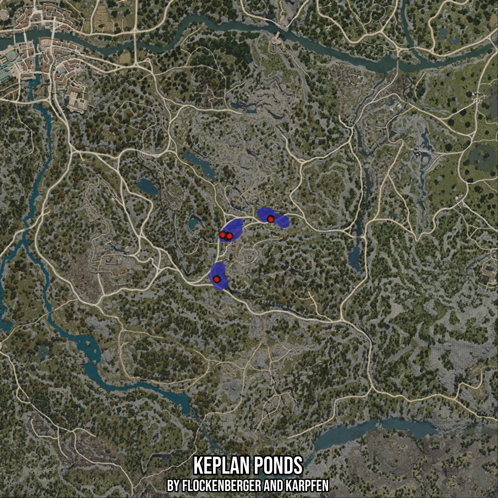

# Keplan Ponds
Created by **flockenberger**

- **Red Points**: Exact in-game waypoints.
- **Colored Areas**: Entire area where the fishing table is consistent.
## ⚠️ Info about your float:
To verify your fishing position without modifying your files, you can do so [here](https://flockenberger.github.io/bdo-fish-position/).
- Or watch the guide [here](https://youtu.be/t-VXcRoNojk)

## Waypoints
Below you'll find the Copy-Paste ready XML file for this Fishing-Zone.

```xml
	<!--
		Waypoints for: Keplan Ponds
		Auto-Generated by: flockenberger
		Preview at: https://github.com/Flockenberger/bdo-fish-waypoints/tree/main/Bookmark/Keplan%20Ponds
	-->
	<WorldmapBookMark>
		<BookMark BookMarkName="1: Keplan Ponds" PosX="-159623.49247932434" PosY="0.0" PosZ="-150287.10181713104" />
		<BookMark BookMarkName="2: Keplan Ponds" PosX="-137938.78617286682" PosY="0.0" PosZ="-141552.98399925232" />
		<BookMark BookMarkName="3: Keplan Ponds" PosX="-164743.49257946014" PosY="0.0" PosZ="-171369.4551706314" />
		<BookMark BookMarkName="4: Keplan Ponds" PosX="-161731.72781467438" PosY="0.0" PosZ="-149383.5723876953" />
		<BookMark BookMarkName="5: Keplan Ponds" PosX="-158418.78657341003" PosY="0.0" PosZ="-149985.92534065247" />
	</WorldmapBookMark>
```

## Usage Guide
[](https://youtu.be/W-bWmKdv8K8)

## Previews
     

 