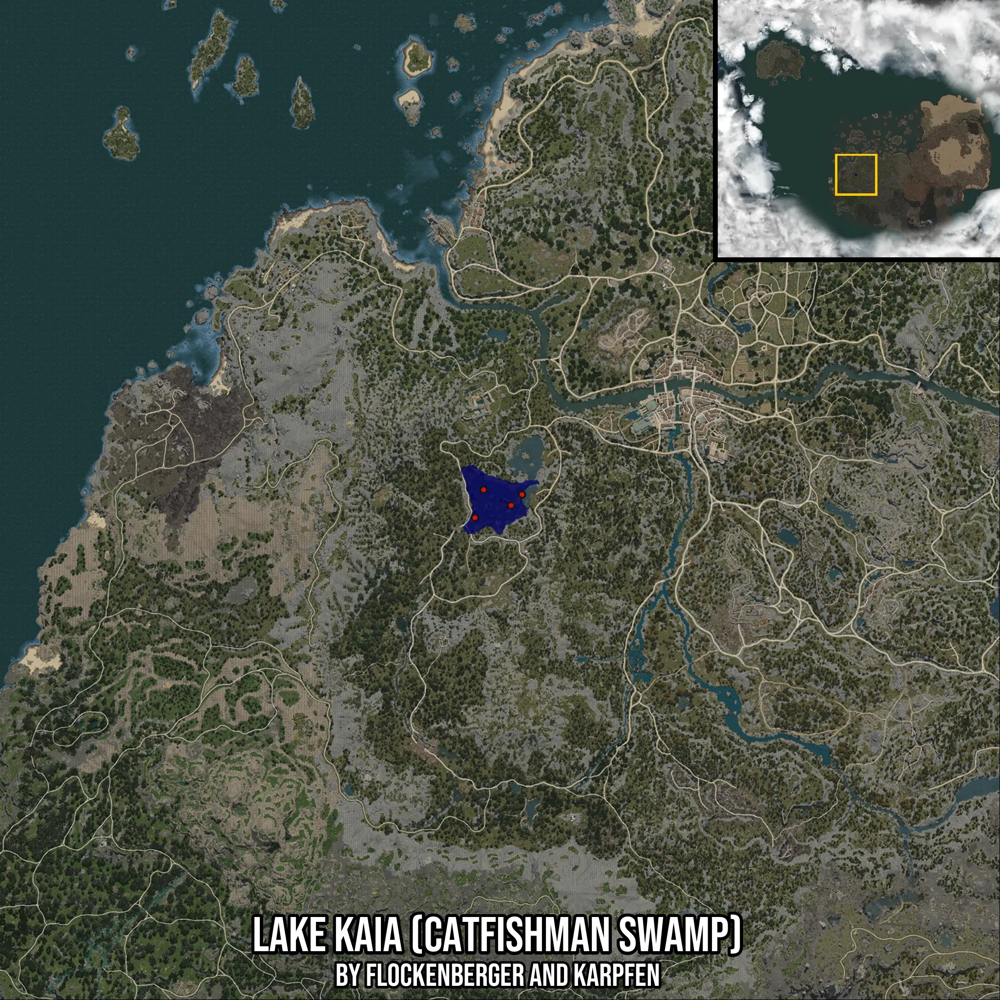

# Lake Kaia (Catfishman Swamp)
Created by **flockenberger**

- **Red Points**: Exact in-game waypoints.
- **Colored Areas**: Entire area where the fishing table is consistent.
## ⚠️ Info about your float:
To verify your fishing position without modifying your files, you can do so [here](https://flockenberger.github.io/bdo-fish-position/).
- Or watch the guide [here](https://youtu.be/t-VXcRoNojk)

## Waypoints
Below you'll find the Copy-Paste ready XML file for this Fishing-Zone.

```xml
	<!--
		Waypoints for: Lake Kaia (Catfishman Swamp)
		Auto-Generated by: flockenberger
		Preview at: https://github.com/Flockenberger/bdo-fish-waypoints/tree/main/Bookmark/Lake%20Kaia%20(Catfishman%20Swamp)
	-->
	<WorldmapBookMark>
		<BookMark BookMarkName="1: Lake Kaia (Catfishman Swamp)" PosX="-344847.025513649" PosY="0.0" PosZ="-107218.86568069458" />
		<BookMark BookMarkName="2: Lake Kaia (Catfishman Swamp)" PosX="-358399.96695518494" PosY="0.0" PosZ="-93967.1007156372" />
		<BookMark BookMarkName="3: Lake Kaia (Catfishman Swamp)" PosX="-355990.5551433563" PosY="0.0" PosZ="-96978.86548042297" />
		<BookMark BookMarkName="4: Lake Kaia (Catfishman Swamp)" PosX="-355087.0257139206" PosY="0.0" PosZ="-99689.45376873016" />
		<BookMark BookMarkName="5: Lake Kaia (Catfishman Swamp)" PosX="-331595.2605485916" PosY="0.0" PosZ="-100291.80672168732" />
	</WorldmapBookMark>
```

## Usage Guide
[](https://youtu.be/W-bWmKdv8K8)

## Previews
     

 