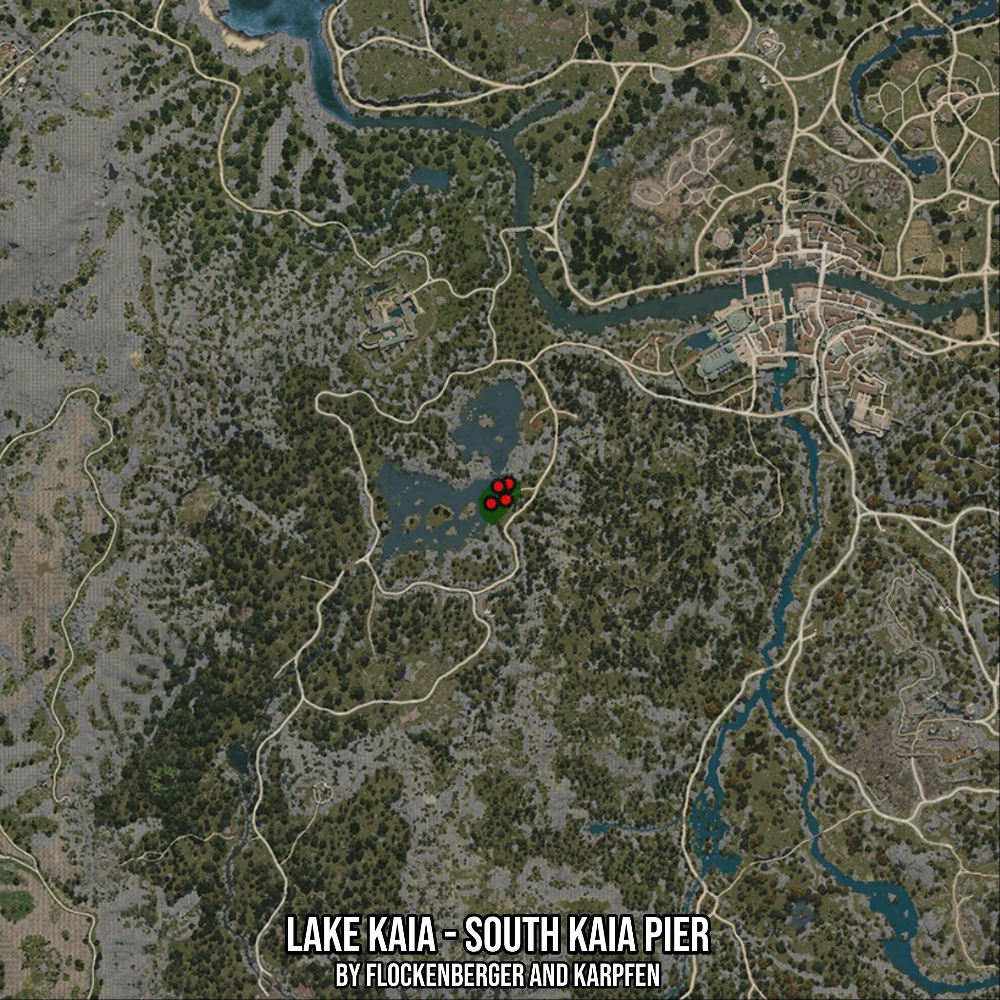

# Lake Kaia - South Kaia Pier
Created by **flockenberger**

- **Red Points**: Exact in-game waypoints.
- **Colored Areas**: Entire area where the fishing table is consistent.
## ⚠️ Info about your float:
To verify your fishing position without modifying your files, you can do so [here](https://flockenberger.github.io/bdo-fish-position/).
- Or watch the guide [here](https://youtu.be/t-VXcRoNojk)

## Waypoints
Below you'll find the Copy-Paste ready XML file for this Fishing-Zone.

```xml
	<!--
		Waypoints for: Lake Kaia - South Kaia Pier
		Auto-Generated by: flockenberger
		Preview at: https://github.com/Flockenberger/bdo-fish-waypoints/tree/main/Bookmark/Lake%20Kaia%20-%20South%20Kaia%20Pier
	-->
	<WorldmapBookMark>
		<BookMark BookMarkName="1: Lake Kaia - South Kaia Pier" PosX="-324065.8486366272" PosY="0.0" PosZ="-102098.86558055878" />
		<BookMark BookMarkName="2: Lake Kaia - South Kaia Pier" PosX="-327378.78987789154" PosY="0.0" PosZ="-105712.9832983017" />
		<BookMark BookMarkName="3: Lake Kaia - South Kaia Pier" PosX="-323162.31920719147" PosY="0.0" PosZ="-100894.15967464447" />
		<BookMark BookMarkName="4: Lake Kaia - South Kaia Pier" PosX="-325571.7310190201" PosY="0.0" PosZ="-101496.51262760162" />
		<BookMark BookMarkName="5: Lake Kaia - South Kaia Pier" PosX="-323764.6721601486" PosY="0.0" PosZ="-104809.45386886597" />
	</WorldmapBookMark>
```

## Usage Guide
[](https://youtu.be/W-bWmKdv8K8)

## Previews
     

 