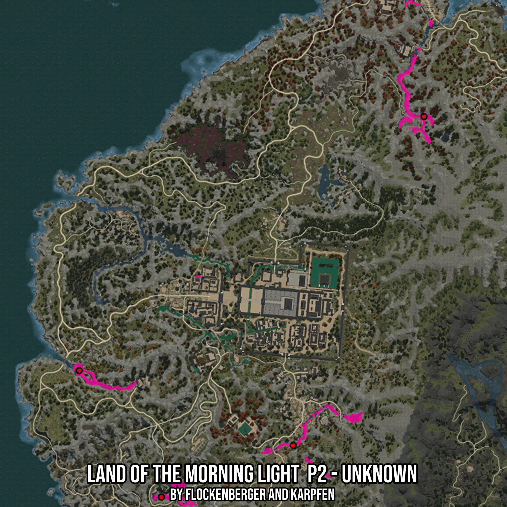

# Land of the Morning Light  P2 - Unknown
Created by **flockenberger**

- **Red Points**: Exact in-game waypoints.
- **Colored Areas**: Entire area where the fishing table is consistent.
## ⚠️ Info about your float:
To verify your fishing position without modifying your files, you can do so [here](https://flockenberger.github.io/bdo-fish-position/).
- Or watch the guide [here](https://youtu.be/t-VXcRoNojk)

## Waypoints
Below you'll find the Copy-Paste ready XML file for this Fishing-Zone.

```xml
	<!--
		Waypoints for: Land of the Morning Light  P2 - Unknown
		Auto-Generated by: flockenberger
		Preview at: https://github.com/Flockenberger/bdo-fish-waypoints/tree/main/Bookmark/Land%20of%20the%20Morning%20Light%20%20P2%20-%20Unknown
	-->
	<WorldmapBookMark>
		<BookMark BookMarkName="1: Land of the Morning Light  P2 - Unknown" PosX="-1341138.8097047806" PosY="0.0" PosZ="1439021.164560318" />
		<BookMark BookMarkName="2: Land of the Morning Light  P2 - Unknown" PosX="-1535698.813509941" PosY="0.0" PosZ="1295661.1617565155" />
		<BookMark BookMarkName="3: Land of the Morning Light  P2 - Unknown" PosX="-1489317.6361322403" PosY="0.0" PosZ="1224282.3368310928" />
		<BookMark BookMarkName="4: Land of the Morning Light  P2 - Unknown" PosX="-1414927.0464420319" PosY="0.0" PosZ="1253496.4550495148" />
		<BookMark BookMarkName="5: Land of the Morning Light  P2 - Unknown" PosX="-1399567.0461416245" PosY="0.0" PosZ="1239943.5136079788" />
	</WorldmapBookMark>
```

## Usage Guide
[](https://youtu.be/W-bWmKdv8K8)

## Previews
     

 