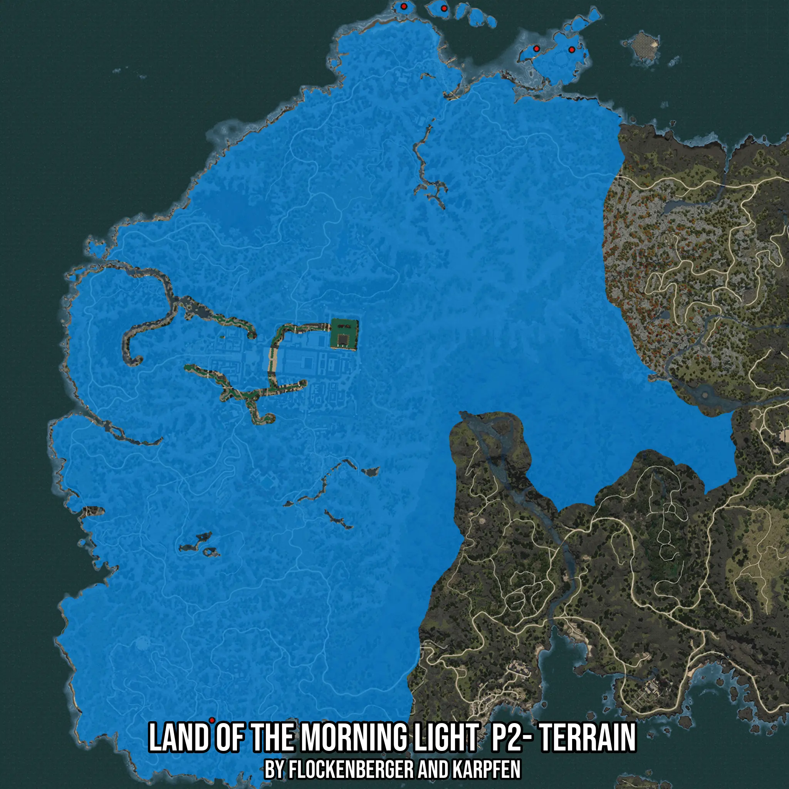

# Land of the Morning Light  P2- Terrain
Created by **flockenberger**

- **Red Points**: Exact in-game waypoints.
- **Colored Areas**: Entire area where the fishing table is consistent.
## ⚠️ Info about your float:
To verify your fishing position without modifying your files, you can do so [here](https://flockenberger.github.io/bdo-fish-position/).
- Or watch the guide [here](https://youtu.be/t-VXcRoNojk)

## Waypoints
Below you'll find the Copy-Paste ready XML file for this Fishing-Zone.

```xml
	<!--
		Waypoints for: Land of the Morning Light  P2- Terrain
		Auto-Generated by: flockenberger
		Preview at: https://github.com/Flockenberger/bdo-fish-waypoints/tree/main/Bookmark/Land%20of%20the%20Morning%20Light%20%20P2-%20Terrain
	-->
	<WorldmapBookMark>
		<BookMark BookMarkName="1: Land of the Morning Light  P2- Terrain" PosX="-1474559.98878479" PosY="0.0" PosZ="1122484.687781334" />
		<BookMark BookMarkName="2: Land of the Morning Light  P2- Terrain" PosX="-1262230.5728673935" PosY="0.0" PosZ="1518230.5778741837" />
		<BookMark BookMarkName="3: Land of the Morning Light  P2- Terrain" PosX="-1337524.6919870377" PosY="-8175.0" PosZ="1542625.8724689484" />
		<BookMark BookMarkName="4: Land of the Morning Light  P2- Terrain" PosX="-1361317.6336288452" PosY="-8175.0" PosZ="1543830.5783748627" />
		<BookMark BookMarkName="5: Land of the Morning Light  P2- Terrain" PosX="-1283011.7497444153" PosY="0.0" PosZ="1518832.9308271408" />
	</WorldmapBookMark>
```

## Usage Guide
[](https://youtu.be/W-bWmKdv8K8)

## Previews
     

 