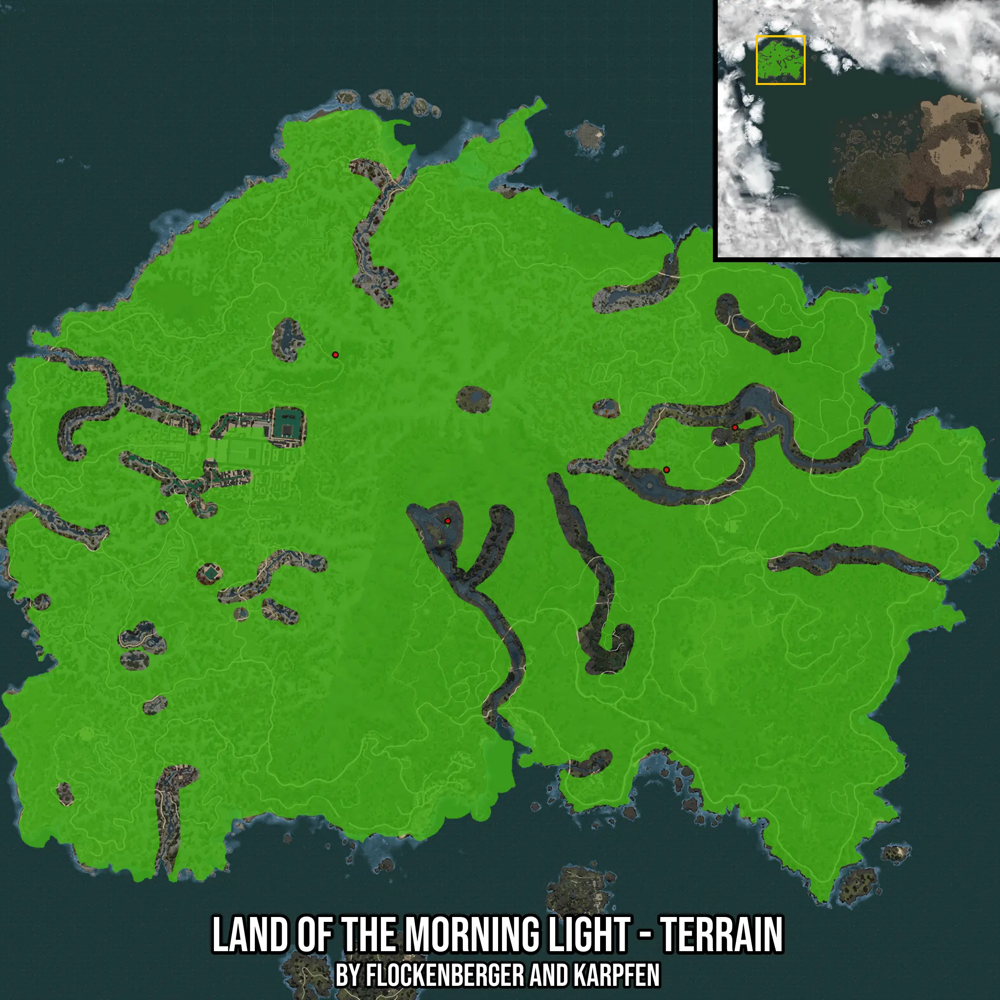

## Land of the Morning Light - Terrain
This folder contains the waypoints for the fishing spot: Land of the Morning Light - Terrain as seen below.

- **Red Points**: Exact in-game waypoints ( Y = 0!).
- **Colored Areas**: Entire area where the fishing table is consistent.

Please note that the preview images can be slightly off due to scaling. The waypoints map to the correct positions!
Automatically generated by **flockenberger**
