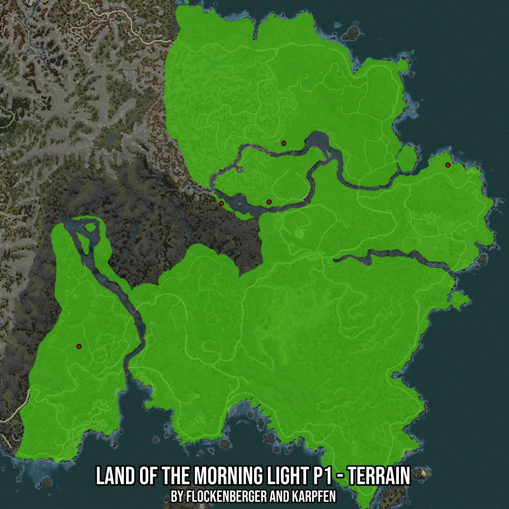

# Land of the Morning Light P1 - Terrain
Created by **flockenberger**

- **Red Points**: Exact in-game waypoints.
- **Colored Areas**: Entire area where the fishing table is consistent.
## ⚠️ Info about your float:
To verify your fishing position without modifying your files, you can do so [here](https://flockenberger.github.io/bdo-fish-position/).
- Or watch the guide [here](https://youtu.be/t-VXcRoNojk)

## Waypoints
Below you'll find the Copy-Paste ready XML file for this Fishing-Zone.

```xml
	<!--
		Waypoints for: Land of the Morning Light P1 - Terrain
		Auto-Generated by: flockenberger
		Preview at: https://github.com/Flockenberger/bdo-fish-waypoints/tree/main/Bookmark/Land%20of%20the%20Morning%20Light%20P1%20-%20Terrain
	-->
	<WorldmapBookMark>
		<BookMark BookMarkName="1: Land of the Morning Light P1 - Terrain" PosX="-1016470.5680608749" PosY="0.0" PosZ="1345355.2803754807" />
		<BookMark BookMarkName="2: Land of the Morning Light P1 - Terrain" PosX="-1148084.688282013" PosY="0.0" PosZ="1362823.516011238" />
		<BookMark BookMarkName="3: Land of the Morning Light P1 - Terrain" PosX="-1312225.8679628372" PosY="0.0" PosZ="1199887.0422363281" />
		<BookMark BookMarkName="4: Land of the Morning Light P1 - Terrain" PosX="-1159830.5708646774" PosY="0.0" PosZ="1315839.9856805801" />
		<BookMark BookMarkName="5: Land of the Morning Light P1 - Terrain" PosX="-1198079.9833774567" PosY="0.0" PosZ="1314635.2797746658" />
	</WorldmapBookMark>
```

## Usage Guide
[](https://youtu.be/W-bWmKdv8K8)

## Previews
     

 