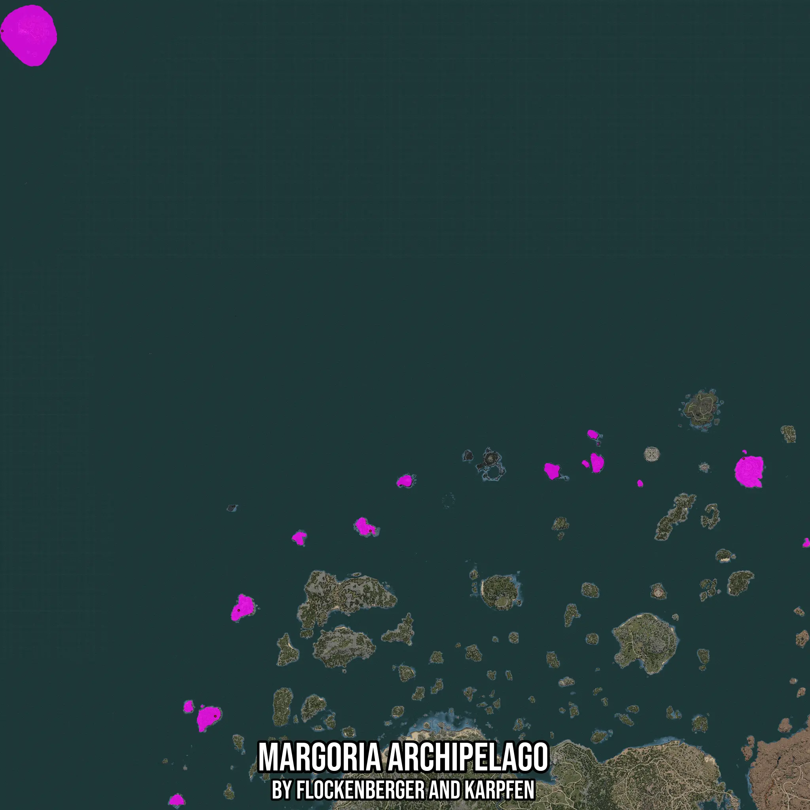

# Margoria Archipelago
Created by **flockenberger**

- **Red Points**: Exact in-game waypoints.
- **Colored Areas**: Entire area where the fishing table is consistent.
## ⚠️ Info about your float:
To verify your fishing position without modifying your files, you can do so [here](https://flockenberger.github.io/bdo-fish-position/).
- Or watch the guide [here](https://youtu.be/t-VXcRoNojk)

## Waypoints
Below you'll find the Copy-Paste ready XML file for this Fishing-Zone.

```xml
	<!--
		Waypoints for: Margoria Archipelago
		Auto-Generated by: flockenberger
		Preview at: https://github.com/Flockenberger/bdo-fish-waypoints/tree/main/Bookmark/Margoria%20Archipelago
	-->
	<WorldmapBookMark>
		<BookMark BookMarkName="1: Margoria Archipelago" PosX="-904131.7423343658" PosY="-8175.0" PosZ="1334814.1036987305" />
		<BookMark BookMarkName="2: Margoria Archipelago" PosX="325571.81112766266" PosY="-8175.0" PosZ="625543.5015916824" />
		<BookMark BookMarkName="3: Margoria Archipelago" PosX="-550851.7354249954" PosY="-8175.0" PosZ="198475.25794506073" />
		<BookMark BookMarkName="4: Margoria Archipelago" PosX="-511999.96995925903" PosY="-8175.0" PosZ="374061.1437320709" />
		<BookMark BookMarkName="5: Margoria Archipelago" PosX="-293647.02451229095" PosY="-8175.0" PosZ="505675.2639532089" />
	</WorldmapBookMark>
```

## Usage Guide
[](https://youtu.be/W-bWmKdv8K8)

## Previews
     

 