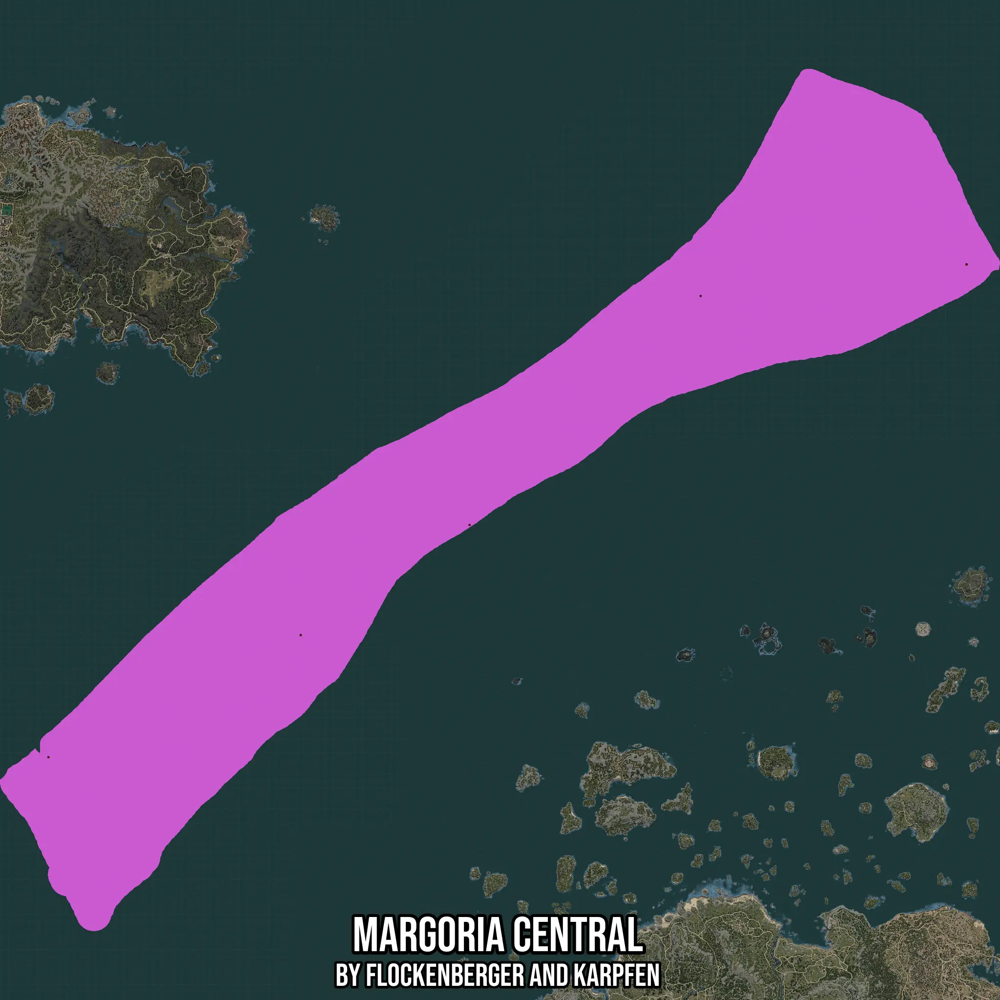

# Margoria Central
Created by **flockenberger**

- **Red Points**: Exact in-game waypoints.
- **Colored Areas**: Entire area where the fishing table is consistent.
## ⚠️ Info about your float:
To verify your fishing position without modifying your files, you can do so [here](https://flockenberger.github.io/bdo-fish-position/).
- Or watch the guide [here](https://youtu.be/t-VXcRoNojk)

## Waypoints
Below you'll find the Copy-Paste ready XML file for this Fishing-Zone.

```xml
	<!--
		Waypoints for: Margoria Central
		Auto-Generated by: flockenberger
		Preview at: https://github.com/Flockenberger/bdo-fish-waypoints/tree/main/Bookmark/Margoria%20Central
	-->
	<WorldmapBookMark>
		<BookMark BookMarkName="1: Margoria Central" PosX="247567.1037197113" PosY="-8175.0" PosZ="1258315.278673172" />
		<BookMark BookMarkName="2: Margoria Central" PosX="-1326079.9858808517" PosY="-8175.0" PosZ="413515.26215076447" />
		<BookMark BookMarkName="3: Margoria Central" PosX="-893590.5656576157" PosY="-8175.0" PosZ="622832.9133033752" />
		<BookMark BookMarkName="4: Margoria Central" PosX="-604159.9717617035" PosY="-8175.0" PosZ="811670.5640554428" />
		<BookMark BookMarkName="5: Margoria Central" PosX="-208112.90519237518" PosY="-8175.0" PosZ="1204103.5129070282" />
	</WorldmapBookMark>
```

## Usage Guide
[](https://youtu.be/W-bWmKdv8K8)

## Previews
     

 