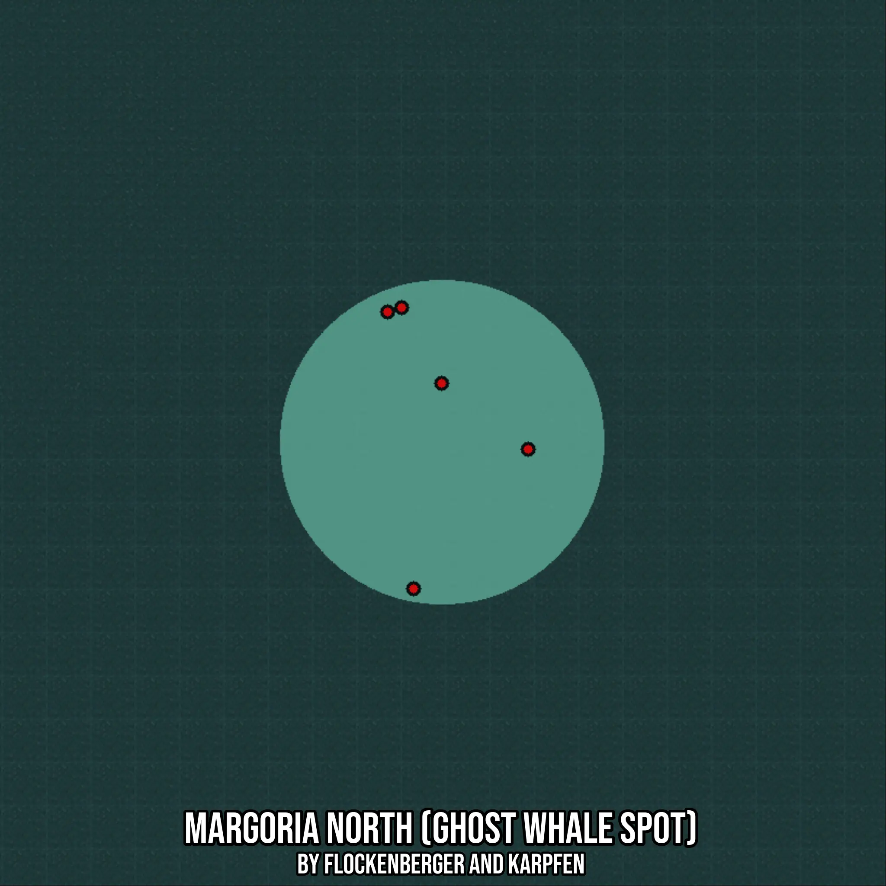

# Margoria North (Ghost Whale Spot)
Created by **flockenberger**

- **Red Points**: Exact in-game waypoints.
- **Colored Areas**: Entire area where the fishing table is consistent.
## ⚠️ Info about your float:
To verify your fishing position without modifying your files, you can do so [here](https://flockenberger.github.io/bdo-fish-position/).
- Or watch the guide [here](https://youtu.be/t-VXcRoNojk)

## Waypoints
Below you'll find the Copy-Paste ready XML file for this Fishing-Zone.

```xml
	<!--
		Waypoints for: Margoria North (Ghost Whale Spot)
		Auto-Generated by: flockenberger
		Preview at: https://github.com/Flockenberger/bdo-fish-waypoints/tree/main/Bookmark/Margoria%20North%20(Ghost%20Whale%20Spot)
	-->
	<WorldmapBookMark>
		<BookMark BookMarkName="1: Margoria North (Ghost Whale Spot)" PosX="-1249279.9843788147" PosY="-8175.0" PosZ="799924.6814727783" />
		<BookMark BookMarkName="2: Margoria North (Ghost Whale Spot)" PosX="-1242051.7489433289" PosY="-8175.0" PosZ="722823.5034942627" />
		<BookMark BookMarkName="3: Margoria North (Ghost Whale Spot)" PosX="-1210127.0424365997" PosY="-8175.0" PosZ="761675.2689599991" />
		<BookMark BookMarkName="4: Margoria North (Ghost Whale Spot)" PosX="-1245364.6901845932" PosY="-8175.0" PosZ="801129.3873786926" />
		<BookMark BookMarkName="5: Margoria North (Ghost Whale Spot)" PosX="-1234221.1605548859" PosY="-8175.0" PosZ="780047.0340251923" />
	</WorldmapBookMark>
```

## Usage Guide
[](https://youtu.be/W-bWmKdv8K8)

## Previews
     

 