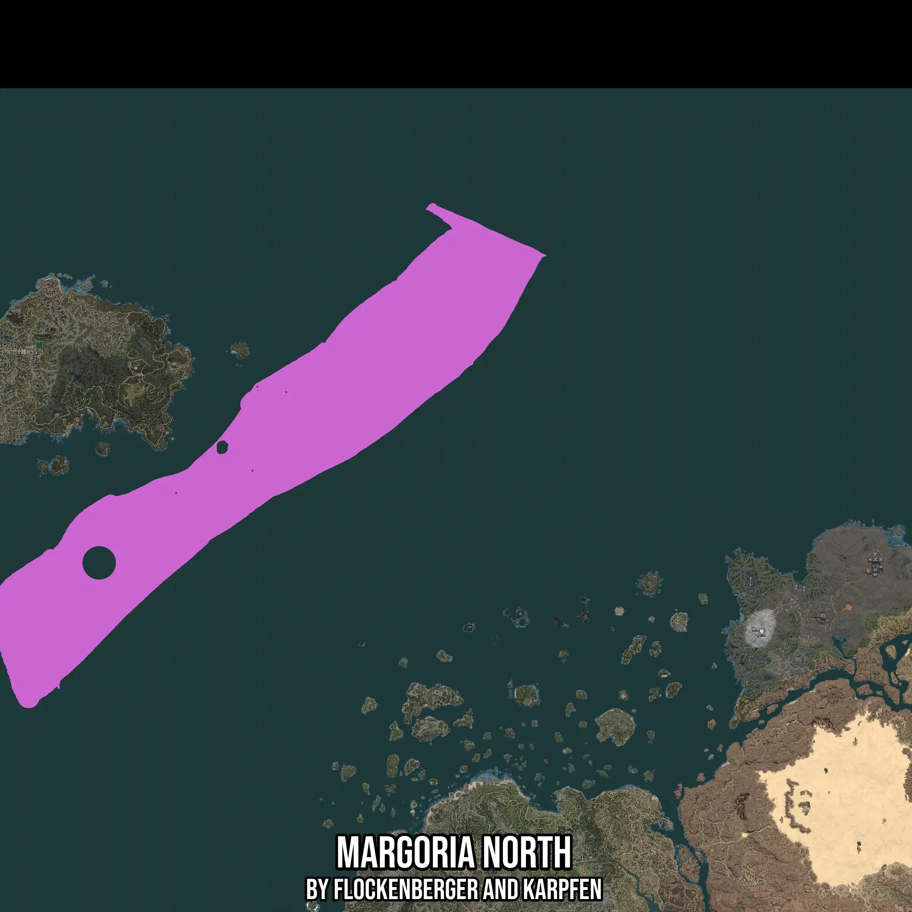

# Margoria North
Created by **flockenberger**

- **Red Points**: Exact in-game waypoints.
- **Colored Areas**: Entire area where the fishing table is consistent.
## ⚠️ Info about your float:
To verify your fishing position without modifying your files, you can do so [here](https://flockenberger.github.io/bdo-fish-position/).
- Or watch the guide [here](https://youtu.be/t-VXcRoNojk)

## Waypoints
Below you'll find the Copy-Paste ready XML file for this Fishing-Zone.

```xml
	<!--
		Waypoints for: Margoria North
		Auto-Generated by: flockenberger
		Preview at: https://github.com/Flockenberger/bdo-fish-waypoints/tree/main/Bookmark/Margoria%20North
	-->
	<WorldmapBookMark>
		<BookMark BookMarkName="1: Margoria North" PosX="-727943.5035943985" PosY="-8175.0" PosZ="1225788.2192134857" />
		<BookMark BookMarkName="2: Margoria North" PosX="994484.7653865814" PosY="-8175.0" PosZ="548141.1471366882" />
		<BookMark BookMarkName="3: Margoria North" PosX="-806249.3874788284" PosY="-8175.0" PosZ="1239943.5136079788" />
		<BookMark BookMarkName="4: Margoria North" PosX="-819501.1524438858" PosY="-8175.0" PosZ="1012856.450343132" />
		<BookMark BookMarkName="5: Margoria North" PosX="-1025807.0388317108" PosY="-8175.0" PosZ="952922.3315238953" />
	</WorldmapBookMark>
```

## Usage Guide
[](https://youtu.be/W-bWmKdv8K8)

## Previews
     

 