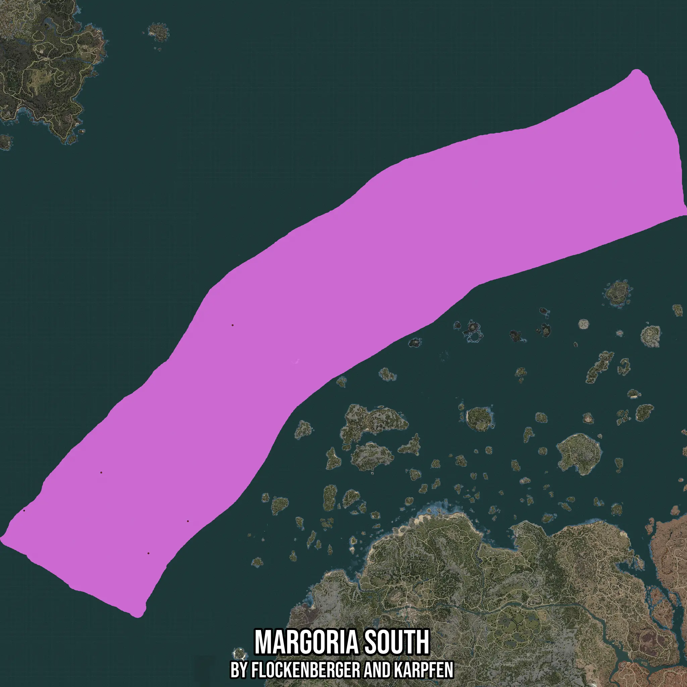

# Margoria South
Created by **flockenberger**

- **Red Points**: Exact in-game waypoints.
- **Colored Areas**: Entire area where the fishing table is consistent.
## ⚠️ Info about your float:
To verify your fishing position without modifying your files, you can do so [here](https://flockenberger.github.io/bdo-fish-position/).
- Or watch the guide [here](https://youtu.be/t-VXcRoNojk)

## Waypoints
Below you'll find the Copy-Paste ready XML file for this Fishing-Zone.

```xml
	<!--
		Waypoints for: Margoria South
		Auto-Generated by: flockenberger
		Preview at: https://github.com/Flockenberger/bdo-fish-waypoints/tree/main/Bookmark/Margoria%20South
	-->
	<WorldmapBookMark>
		<BookMark BookMarkName="1: Margoria South" PosX="-674334.0907812119" PosY="-8175.0" PosZ="630663.5016918182" />
		<BookMark BookMarkName="2: Margoria South" PosX="-782155.2693605423" PosY="-8175.0" PosZ="157515.2571439743" />
		<BookMark BookMarkName="3: Margoria South" PosX="-877327.0359277725" PosY="-8175.0" PosZ="80112.9026889801" />
		<BookMark BookMarkName="4: Margoria South" PosX="-1177298.8065004349" PosY="-8175.0" PosZ="183115.25764465332" />
		<BookMark BookMarkName="5: Margoria South" PosX="-991171.7440366745" PosY="-8175.0" PosZ="274974.0829706192" />
	</WorldmapBookMark>
```

## Usage Guide
[](https://youtu.be/W-bWmKdv8K8)

## Previews
     

 