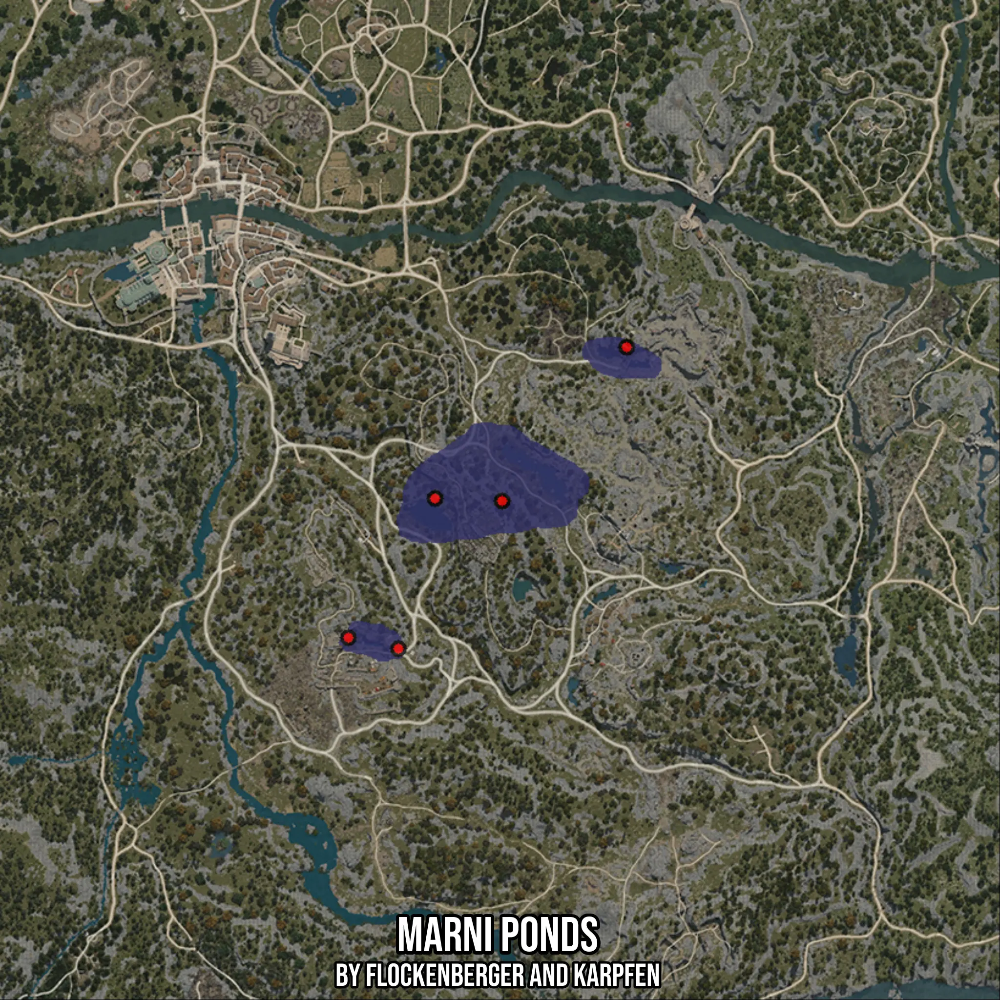

# Marni Ponds
Created by **flockenberger**

- **Red Points**: Exact in-game waypoints.
- **Colored Areas**: Entire area where the fishing table is consistent.
## ⚠️ Info about your float:
To verify your fishing position without modifying your files, you can do so [here](https://flockenberger.github.io/bdo-fish-position/).
- Or watch the guide [here](https://youtu.be/t-VXcRoNojk)

## Waypoints
Below you'll find the Copy-Paste ready XML file for this Fishing-Zone.

```xml
	<!--
		Waypoints for: Marni Ponds
		Auto-Generated by: flockenberger
		Preview at: https://github.com/Flockenberger/bdo-fish-waypoints/tree/main/Bookmark/Marni%20Ponds
	-->
	<WorldmapBookMark>
		<BookMark BookMarkName="1: Marni Ponds" PosX="-197872.90499210358" PosY="0.0" PosZ="-121374.16007518768" />
		<BookMark BookMarkName="2: Marni Ponds" PosX="-150588.19818496704" PosY="0.0" PosZ="-84028.27699184418" />
		<BookMark BookMarkName="3: Marni Ponds" PosX="-206908.19928646088" PosY="0.0" PosZ="-158418.8666820526" />
		<BookMark BookMarkName="4: Marni Ponds" PosX="-181308.19878578186" PosY="0.0" PosZ="-121976.51302814484" />
		<BookMark BookMarkName="5: Marni Ponds" PosX="-219256.43482208252" PosY="0.0" PosZ="-155708.27839374542" />
	</WorldmapBookMark>
```

## Usage Guide
[](https://youtu.be/W-bWmKdv8K8)

## Previews
     

 