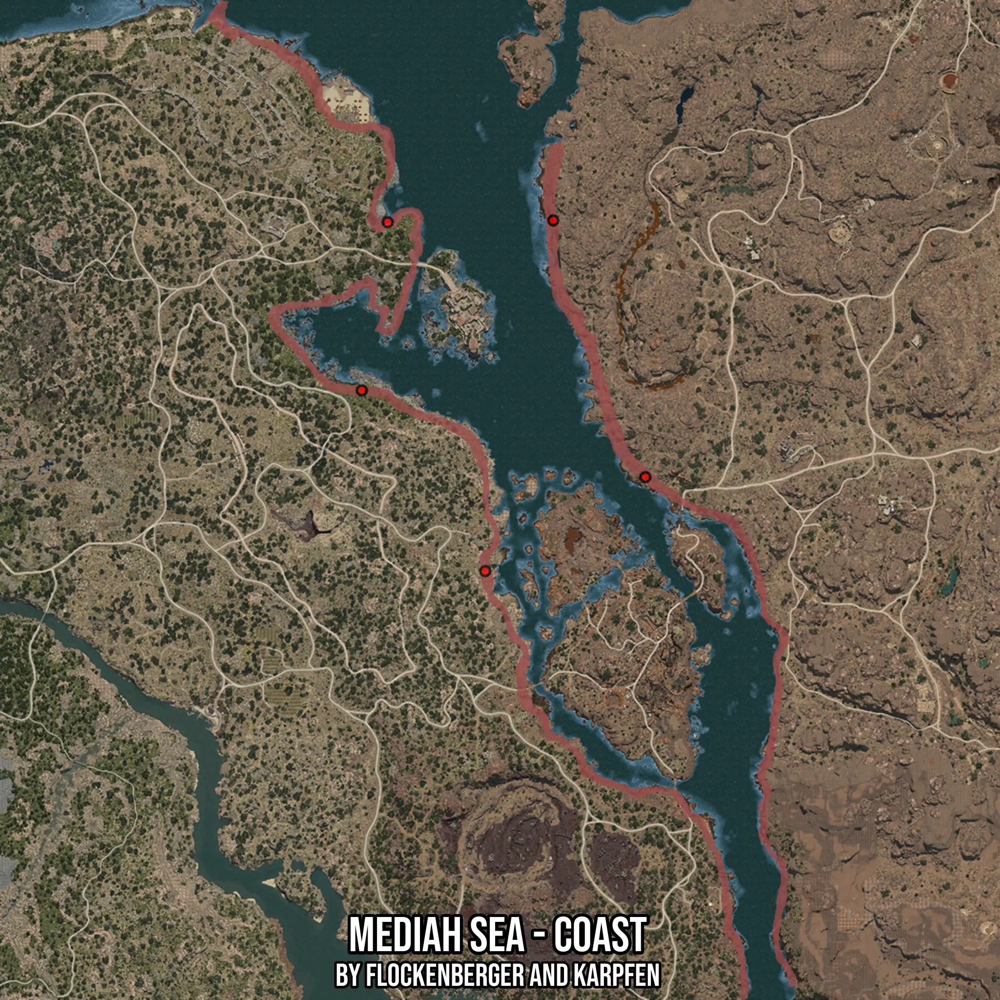

# Mediah Sea - Coast
Created by **flockenberger**

- **Red Points**: Exact in-game waypoints.
- **Colored Areas**: Entire area where the fishing table is consistent.
## ⚠️ Info about your float:
To verify your fishing position without modifying your files, you can do so [here](https://flockenberger.github.io/bdo-fish-position/).
- Or watch the guide [here](https://youtu.be/t-VXcRoNojk)

## Waypoints
Below you'll find the Copy-Paste ready XML file for this Fishing-Zone.

```xml
	<!--
		Waypoints for: Mediah Sea - Coast
		Auto-Generated by: flockenberger
		Preview at: https://github.com/Flockenberger/bdo-fish-waypoints/tree/main/Bookmark/Mediah%20Sea%20-%20Coast
	-->
	<WorldmapBookMark>
		<BookMark BookMarkName="1: Mediah Sea - Coast" PosX="283708.2808971405" PosY="0.0" PosZ="85534.07926559448" />
		<BookMark BookMarkName="2: Mediah Sea - Coast" PosX="370447.1061229706" PosY="0.0" PosZ="-301.2165307998657" />
		<BookMark BookMarkName="3: Mediah Sea - Coast" PosX="316536.51683330536" PosY="0.0" PosZ="-31924.746561050415" />
		<BookMark BookMarkName="4: Mediah Sea - Coast" PosX="274974.1630792618" PosY="0.0" PosZ="28912.90168762207" />
		<BookMark BookMarkName="5: Mediah Sea - Coast" PosX="339425.9290456772" PosY="0.0" PosZ="86136.43221855164" />
	</WorldmapBookMark>
```

## Usage Guide
[](https://youtu.be/W-bWmKdv8K8)

## Previews
     

 