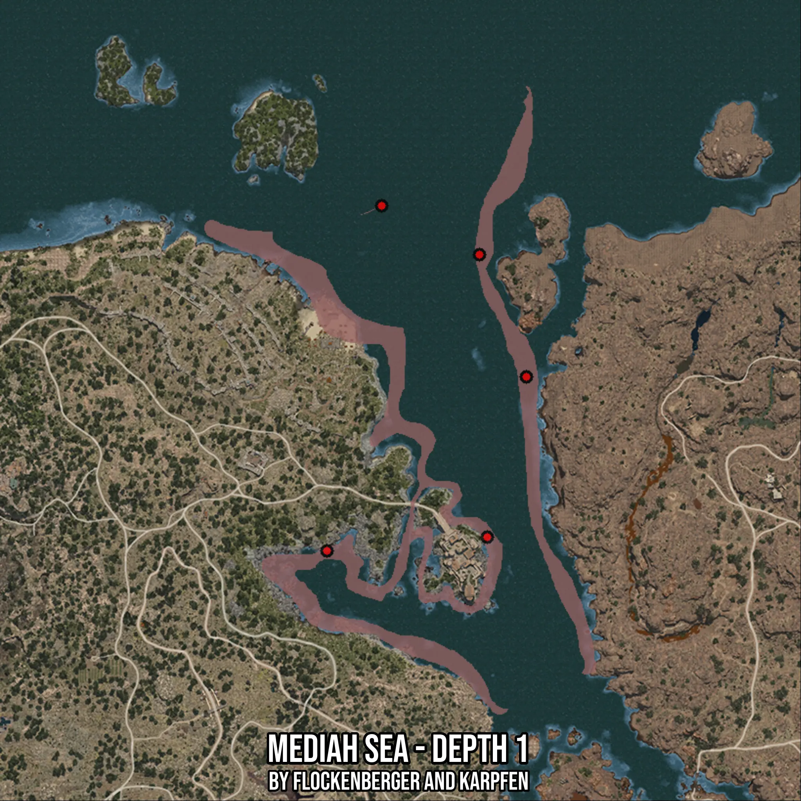

# Mediah Sea - Depth 1
Created by **flockenberger**

- **Red Points**: Exact in-game waypoints.
- **Colored Areas**: Entire area where the fishing table is consistent.
## ⚠️ Info about your float:
To verify your fishing position without modifying your files, you can do so [here](https://flockenberger.github.io/bdo-fish-position/).
- Or watch the guide [here](https://youtu.be/t-VXcRoNojk)

## Waypoints
Below you'll find the Copy-Paste ready XML file for this Fishing-Zone.

```xml
	<!--
		Waypoints for: Mediah Sea - Depth 1
		Auto-Generated by: flockenberger
		Preview at: https://github.com/Flockenberger/bdo-fish-waypoints/tree/main/Bookmark/Mediah%20Sea%20-%20Depth%201
	-->
	<WorldmapBookMark>
		<BookMark BookMarkName="1: Mediah Sea - Depth 1" PosX="268649.45707321167" PosY="-8175.0" PosZ="56922.3140001297" />
		<BookMark BookMarkName="2: Mediah Sea - Depth 1" PosX="315632.9874038696" PosY="-8175.0" PosZ="148178.78637313843" />
		<BookMark BookMarkName="3: Mediah Sea - Depth 1" PosX="285515.33975601196" PosY="-8175.0" PosZ="163237.61019706726" />
		<BookMark BookMarkName="4: Mediah Sea - Depth 1" PosX="330089.4582748413" PosY="-8175.0" PosZ="110531.72681331635" />
		<BookMark BookMarkName="5: Mediah Sea - Depth 1" PosX="318042.39921569824" PosY="-8175.0" PosZ="61138.78467082977" />
	</WorldmapBookMark>
```

## Usage Guide
[](https://youtu.be/W-bWmKdv8K8)

## Previews
     

 