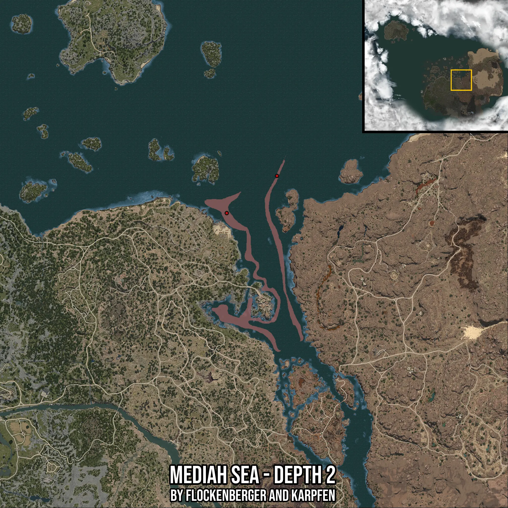

# Mediah Sea - Depth 2
Created by **flockenberger**

- **Red Points**: Exact in-game waypoints.
- **Colored Areas**: Entire area where the fishing table is consistent.
## ⚠️ Info about your float:
To verify your fishing position without modifying your files, you can do so [here](https://flockenberger.github.io/bdo-fish-position/).
- Or watch the guide [here](https://youtu.be/t-VXcRoNojk)

## Waypoints
Below you'll find the Copy-Paste ready XML file for this Fishing-Zone.

```xml
	<!--
		Waypoints for: Mediah Sea - Depth 2
		Auto-Generated by: flockenberger
		Preview at: https://github.com/Flockenberger/bdo-fish-waypoints/tree/main/Bookmark/Mediah%20Sea%20-%20Depth%202
	-->
	<WorldmapBookMark>
		<BookMark BookMarkName="1: Mediah Sea - Depth 2" PosX="296658.8693857193" PosY="-8175.0" PosZ="32527.01940536499" />
		<BookMark BookMarkName="2: Mediah Sea - Depth 2" PosX="324367.10522174835" PosY="-8175.0" PosZ="111134.0797662735" />
		<BookMark BookMarkName="3: Mediah Sea - Depth 2" PosX="277082.3984146118" PosY="-8175.0" PosZ="38550.54893493652" />
		<BookMark BookMarkName="4: Mediah Sea - Depth 2" PosX="317741.22273921967" PosY="-8175.0" PosZ="130409.3742609024" />
		<BookMark BookMarkName="5: Mediah Sea - Depth 2" PosX="318644.7521686554" PosY="-8175.0" PosZ="68668.19658279419" />
	</WorldmapBookMark>
```

## Usage Guide
[](https://youtu.be/W-bWmKdv8K8)

## Previews
     

 