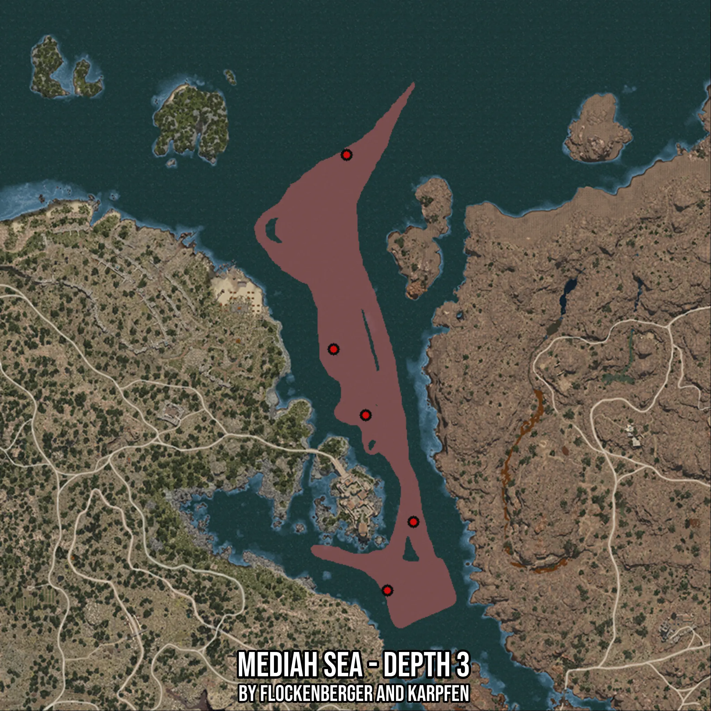

# Mediah Sea - Depth 3
Created by **flockenberger**

- **Red Points**: Exact in-game waypoints.
- **Colored Areas**: Entire area where the fishing table is consistent.
## ⚠️ Info about your float:
To verify your fishing position without modifying your files, you can do so [here](https://flockenberger.github.io/bdo-fish-position/).
- Or watch the guide [here](https://youtu.be/t-VXcRoNojk)

## Waypoints
Below you'll find the Copy-Paste ready XML file for this Fishing-Zone.

```xml
	<!--
		Waypoints for: Mediah Sea - Depth 3
		Auto-Generated by: flockenberger
		Preview at: https://github.com/Flockenberger/bdo-fish-waypoints/tree/main/Bookmark/Mediah%20Sea%20-%20Depth%203
	-->
	<WorldmapBookMark>
		<BookMark BookMarkName="1: Mediah Sea - Depth 3" PosX="313524.7520685196" PosY="-8175.0" PosZ="83727.02040672302" />
		<BookMark BookMarkName="2: Mediah Sea - Depth 3" PosX="302381.22243881226" PosY="-8175.0" PosZ="106616.43261909485" />
		<BookMark BookMarkName="3: Mediah Sea - Depth 3" PosX="330089.4582748413" PosY="-8175.0" PosZ="46682.31379985809" />
		<BookMark BookMarkName="4: Mediah Sea - Depth 3" PosX="306898.8695859909" PosY="-8175.0" PosZ="174079.96335029602" />
		<BookMark BookMarkName="5: Mediah Sea - Depth 3" PosX="321054.163980484" PosY="-8175.0" PosZ="22889.372158050537" />
	</WorldmapBookMark>
```

## Usage Guide
[](https://youtu.be/W-bWmKdv8K8)

## Previews
     

 