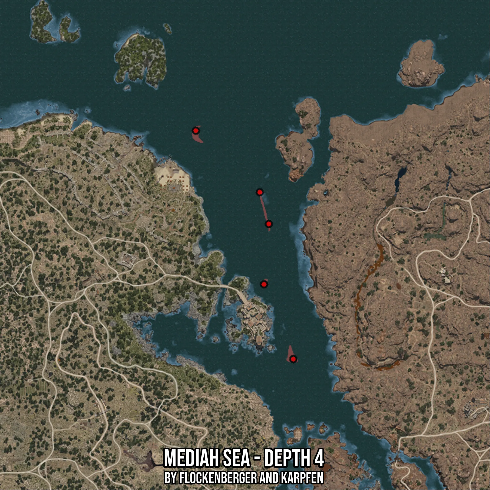

# Mediah Sea - Depth 4
Created by **flockenberger**

- **Red Points**: Exact in-game waypoints.
- **Colored Areas**: Entire area where the fishing table is consistent.
## ⚠️ Info about your float:
To verify your fishing position without modifying your files, you can do so [here](https://flockenberger.github.io/bdo-fish-position/).
- Or watch the guide [here](https://youtu.be/t-VXcRoNojk)

## Waypoints
Below you'll find the Copy-Paste ready XML file for this Fishing-Zone.

```xml
	<!--
		Waypoints for: Mediah Sea - Depth 4
		Auto-Generated by: flockenberger
		Preview at: https://github.com/Flockenberger/bdo-fish-waypoints/tree/main/Bookmark/Mediah%20Sea%20-%20Depth%204
	-->
	<WorldmapBookMark>
		<BookMark BookMarkName="1: Mediah Sea - Depth 4" PosX="329788.28179836273" PosY="-8175.0" PosZ="34635.25474071503" />
		<BookMark BookMarkName="2: Mediah Sea - Depth 4" PosX="280696.51613235474" PosY="-8175.0" PosZ="149684.6687555313" />
		<BookMark BookMarkName="3: Mediah Sea - Depth 4" PosX="312922.39911556244" PosY="-8175.0" PosZ="118663.49167823792" />
		<BookMark BookMarkName="4: Mediah Sea - Depth 4" PosX="315030.6344509125" PosY="-8175.0" PosZ="72282.31430053711" />
		<BookMark BookMarkName="5: Mediah Sea - Depth 4" PosX="317440.0462627411" PosY="-8175.0" PosZ="102701.13842487335" />
	</WorldmapBookMark>
```

## Usage Guide
[](https://youtu.be/W-bWmKdv8K8)

## Previews
     

 