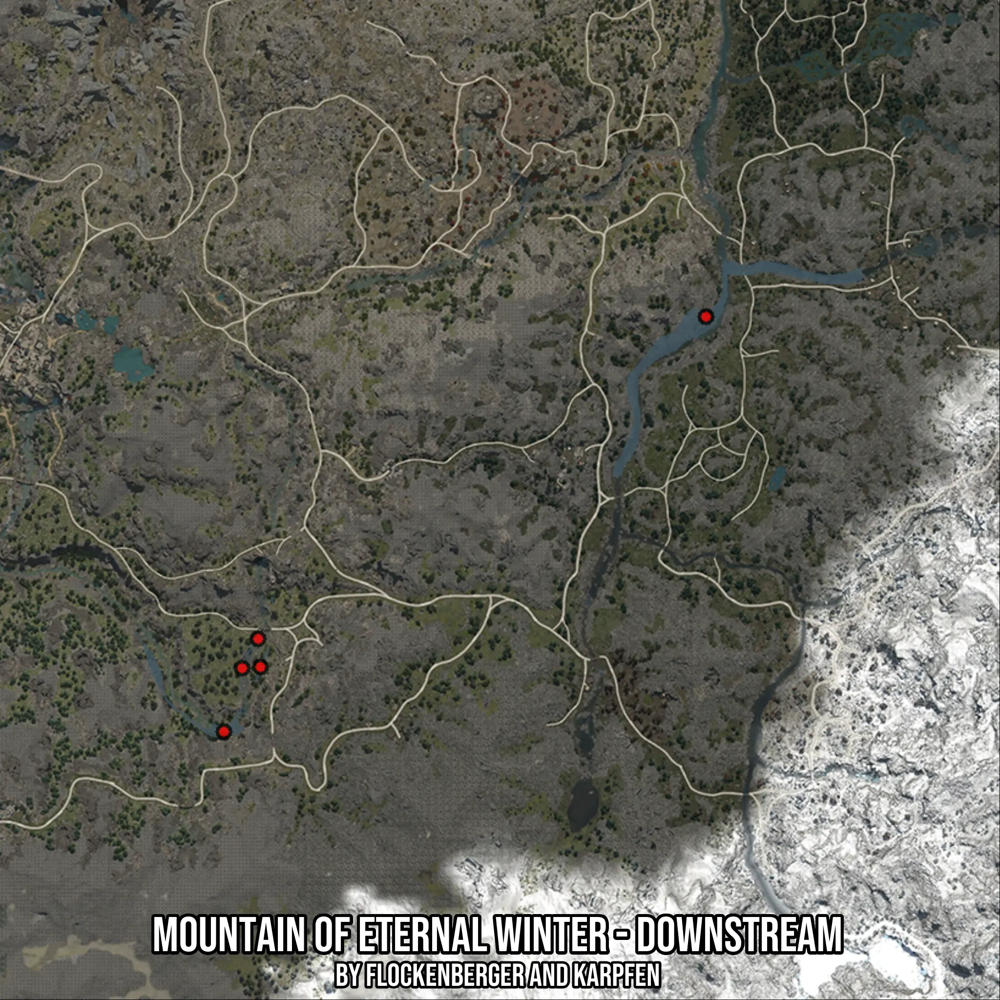

# Mountain of Eternal Winter - Downstream
Created by **flockenberger**

- **Red Points**: Exact in-game waypoints.
- **Colored Areas**: Entire area where the fishing table is consistent.
## ⚠️ Info about your float:
To verify your fishing position without modifying your files, you can do so [here](https://flockenberger.github.io/bdo-fish-position/).
- Or watch the guide [here](https://youtu.be/t-VXcRoNojk)

## Waypoints
Below you'll find the Copy-Paste ready XML file for this Fishing-Zone.

```xml
	<!--
		Waypoints for: Mountain of Eternal Winter - Downstream
		Auto-Generated by: flockenberger
		Preview at: https://github.com/Flockenberger/bdo-fish-waypoints/tree/main/Bookmark/Mountain%20of%20Eternal%20Winter%20-%20Downstream
	-->
	<WorldmapBookMark>
		<BookMark BookMarkName="1: Mountain of Eternal Winter - Downstream" PosX="121976.51302814484" PosY="0.0" PosZ="-399360.04786491394" />
		<BookMark BookMarkName="2: Mountain of Eternal Winter - Downstream" PosX="3011.8048191070557" PosY="0.0" PosZ="-501760.04986763" />
		<BookMark BookMarkName="3: Mountain of Eternal Winter - Downstream" PosX="12047.099113464355" PosY="0.0" PosZ="-485797.69661426544" />
		<BookMark BookMarkName="4: Mountain of Eternal Winter - Downstream" PosX="7529.451966285706" PosY="0.0" PosZ="-486098.873090744" />
		<BookMark BookMarkName="5: Mountain of Eternal Winter - Downstream" PosX="11444.746160507202" PosY="0.0" PosZ="-478870.6376552582" />
	</WorldmapBookMark>
```

## Usage Guide
[](https://youtu.be/W-bWmKdv8K8)

## Previews
     

 