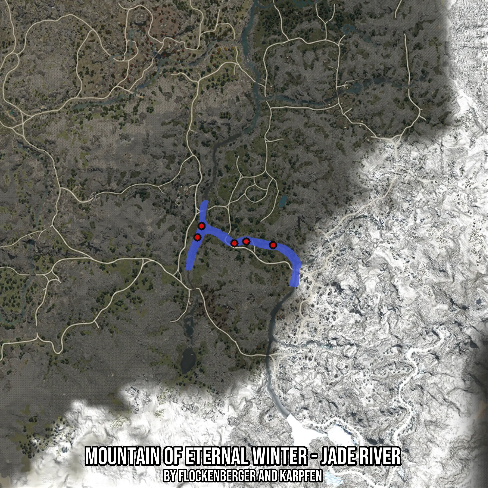

# Mountain of Eternal Winter - Jade River
Created by **flockenberger**

- **Red Points**: Exact in-game waypoints.
- **Colored Areas**: Entire area where the fishing table is consistent.
## ⚠️ Info about your float:
To verify your fishing position without modifying your files, you can do so [here](https://flockenberger.github.io/bdo-fish-position/).
- Or watch the guide [here](https://youtu.be/t-VXcRoNojk)

## Waypoints
Below you'll find the Copy-Paste ready XML file for this Fishing-Zone.

```xml
	<!--
		Waypoints for: Mountain of Eternal Winter - Jade River
		Auto-Generated by: flockenberger
		Preview at: https://github.com/Flockenberger/bdo-fish-waypoints/tree/main/Bookmark/Mountain%20of%20Eternal%20Winter%20-%20Jade%20River
	-->
	<WorldmapBookMark>
		<BookMark BookMarkName="1: Mountain of Eternal Winter - Jade River" PosX="115049.45406913757" PosY="0.0" PosZ="-460498.872590065" />
		<BookMark BookMarkName="2: Mountain of Eternal Winter - Jade River" PosX="98484.74786281586" PosY="0.0" PosZ="-451764.7547721863" />
		<BookMark BookMarkName="3: Mountain of Eternal Winter - Jade River" PosX="121072.9835987091" PosY="0.0" PosZ="-459595.3431606293" />
		<BookMark BookMarkName="4: Mountain of Eternal Winter - Jade River" PosX="134625.92504024506" PosY="0.0" PosZ="-461402.40201950073" />
		<BookMark BookMarkName="5: Mountain of Eternal Winter - Jade River" PosX="96376.51252746582" PosY="0.0" PosZ="-457487.10782527924" />
	</WorldmapBookMark>
```

## Usage Guide
[](https://youtu.be/W-bWmKdv8K8)

## Previews
     

 