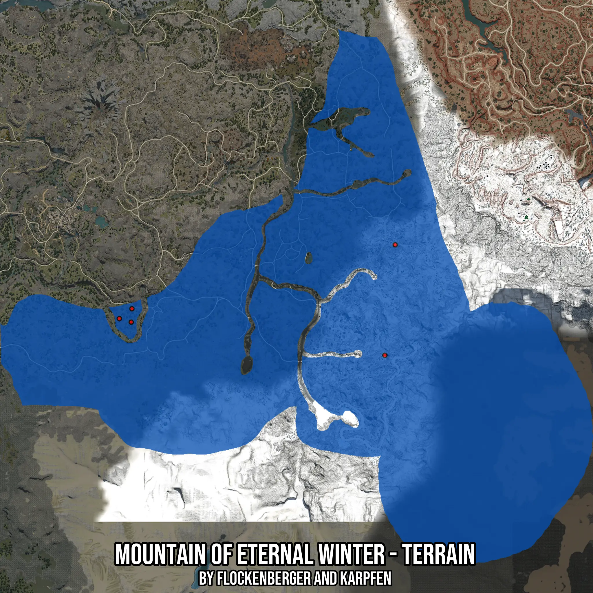

# Mountain of Eternal Winter - Terrain
Created by **flockenberger**

- **Red Points**: Exact in-game waypoints.
- **Colored Areas**: Entire area where the fishing table is consistent.
## ⚠️ Info about your float:
To verify your fishing position without modifying your files, you can do so [here](https://flockenberger.github.io/bdo-fish-position/).
- Or watch the guide [here](https://youtu.be/t-VXcRoNojk)

## Waypoints
Below you'll find the Copy-Paste ready XML file for this Fishing-Zone.

```xml
	<!--
		Waypoints for: Mountain of Eternal Winter - Terrain
		Auto-Generated by: flockenberger
		Preview at: https://github.com/Flockenberger/bdo-fish-waypoints/tree/main/Bookmark/Mountain%20of%20Eternal%20Winter%20-%20Terrain
	-->
	<WorldmapBookMark>
		<BookMark BookMarkName="1: Mountain of Eternal Winter - Terrain" PosX="196668.27919483185" PosY="0.0" PosZ="-512602.40302085876" />
		<BookMark BookMarkName="2: Mountain of Eternal Winter - Terrain" PosX="3011.8048191070557" PosY="0.0" PosZ="-487303.5789966583" />
		<BookMark BookMarkName="3: Mountain of Eternal Winter - Terrain" PosX="204498.86758327484" PosY="0.0" PosZ="-428272.9896068573" />
		<BookMark BookMarkName="4: Mountain of Eternal Winter - Terrain" PosX="3614.157772064209" PosY="0.0" PosZ="-477063.5787963867" />
		<BookMark BookMarkName="5: Mountain of Eternal Winter - Terrain" PosX="-6023.489475250244" PosY="0.0" PosZ="-484592.99070835114" />
	</WorldmapBookMark>
```

## Usage Guide
[](https://youtu.be/W-bWmKdv8K8)

## Previews
     

 