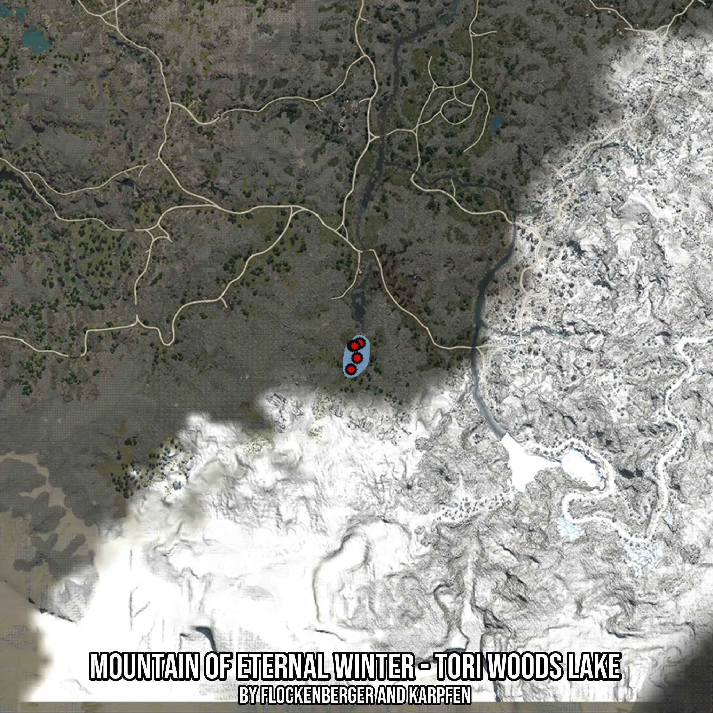

# Mountain of Eternal Winter - Tori Woods Lake
Created by **flockenberger**

- **Red Points**: Exact in-game waypoints.
- **Colored Areas**: Entire area where the fishing table is consistent.
## ⚠️ Info about your float:
To verify your fishing position without modifying your files, you can do so [here](https://flockenberger.github.io/bdo-fish-position/).
- Or watch the guide [here](https://youtu.be/t-VXcRoNojk)

## Waypoints
Below you'll find the Copy-Paste ready XML file for this Fishing-Zone.

```xml
	<!--
		Waypoints for: Mountain of Eternal Winter - Tori Woods Lake
		Auto-Generated by: flockenberger
		Preview at: https://github.com/Flockenberger/bdo-fish-waypoints/tree/main/Bookmark/Mountain%20of%20Eternal%20Winter%20-%20Tori%20Woods%20Lake
	-->
	<WorldmapBookMark>
		<BookMark BookMarkName="1: Mountain of Eternal Winter - Tori Woods Lake" PosX="91557.6889038086" PosY="0.0" PosZ="-520734.16788578033" />
		<BookMark BookMarkName="2: Mountain of Eternal Winter - Tori Woods Lake" PosX="89449.45356845856" PosY="0.0" PosZ="-524649.4620800018" />
		<BookMark BookMarkName="3: Mountain of Eternal Winter - Tori Woods Lake" PosX="90051.80652141571" PosY="0.0" PosZ="-516517.69721508026" />
		<BookMark BookMarkName="4: Mountain of Eternal Winter - Tori Woods Lake" PosX="92461.21833324432" PosY="0.0" PosZ="-515614.16778564453" />
		<BookMark BookMarkName="5: Mountain of Eternal Winter - Tori Woods Lake" PosX="90654.15947437286" PosY="0.0" PosZ="-516517.69721508026" />
	</WorldmapBookMark>
```

## Usage Guide
[](https://youtu.be/W-bWmKdv8K8)

## Previews
     

 