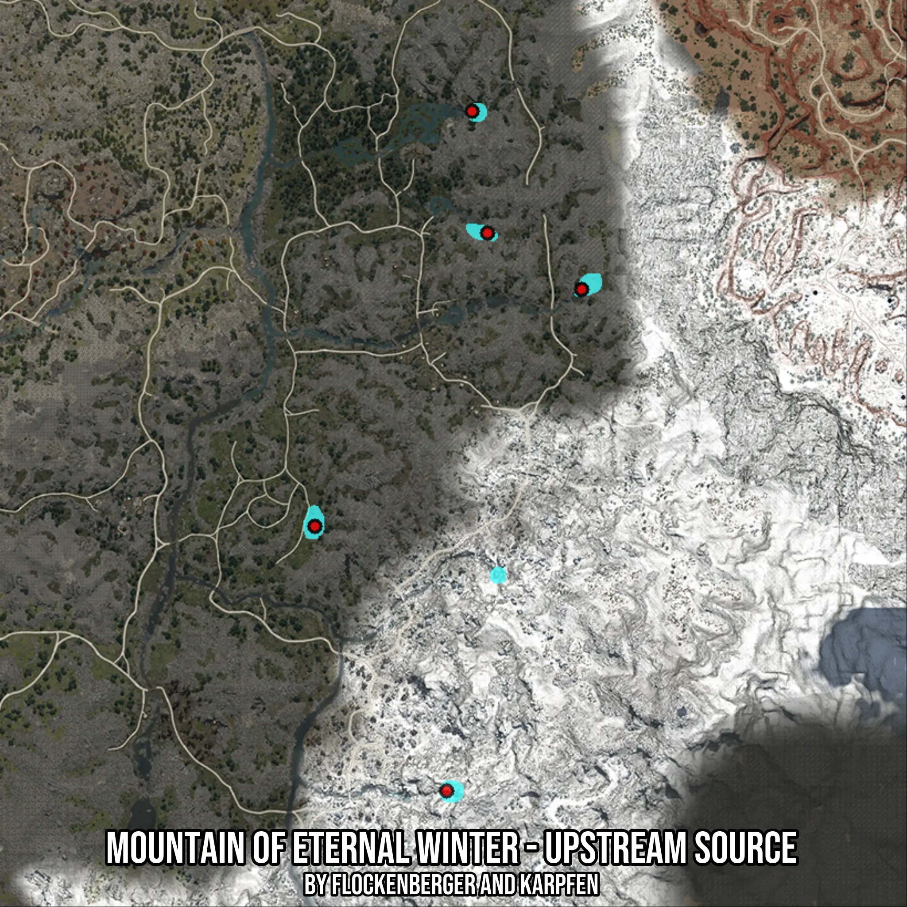

# Mountain of Eternal Winter - Upstream Source
Created by **flockenberger**

- **Red Points**: Exact in-game waypoints.
- **Colored Areas**: Entire area where the fishing table is consistent.
## ⚠️ Info about your float:
To verify your fishing position without modifying your files, you can do so [here](https://flockenberger.github.io/bdo-fish-position/).
- Or watch the guide [here](https://youtu.be/t-VXcRoNojk)

## Waypoints
Below you'll find the Copy-Paste ready XML file for this Fishing-Zone.

```xml
	<!--
		Waypoints for: Mountain of Eternal Winter - Upstream Source
		Auto-Generated by: flockenberger
		Preview at: https://github.com/Flockenberger/bdo-fish-waypoints/tree/main/Bookmark/Mountain%20of%20Eternal%20Winter%20-%20Upstream%20Source
	-->
	<WorldmapBookMark>
		<BookMark BookMarkName="1: Mountain of Eternal Winter - Upstream Source" PosX="138842.39571094513" PosY="0.0" PosZ="-439416.51923656464" />
		<BookMark BookMarkName="2: Mountain of Eternal Winter - Upstream Source" PosX="211425.9265422821" PosY="0.0" PosZ="-374964.75327014923" />
		<BookMark BookMarkName="3: Mountain of Eternal Winter - Upstream Source" PosX="174682.39641189575" PosY="0.0" PosZ="-511397.69711494446" />
		<BookMark BookMarkName="4: Mountain of Eternal Winter - Upstream Source" PosX="185825.9260416031" PosY="0.0" PosZ="-359604.7529697418" />
		<BookMark BookMarkName="5: Mountain of Eternal Winter - Upstream Source" PosX="181609.45537090302" PosY="0.0" PosZ="-326475.3405570984" />
	</WorldmapBookMark>
```

## Usage Guide
[](https://youtu.be/W-bWmKdv8K8)

## Previews
     

 