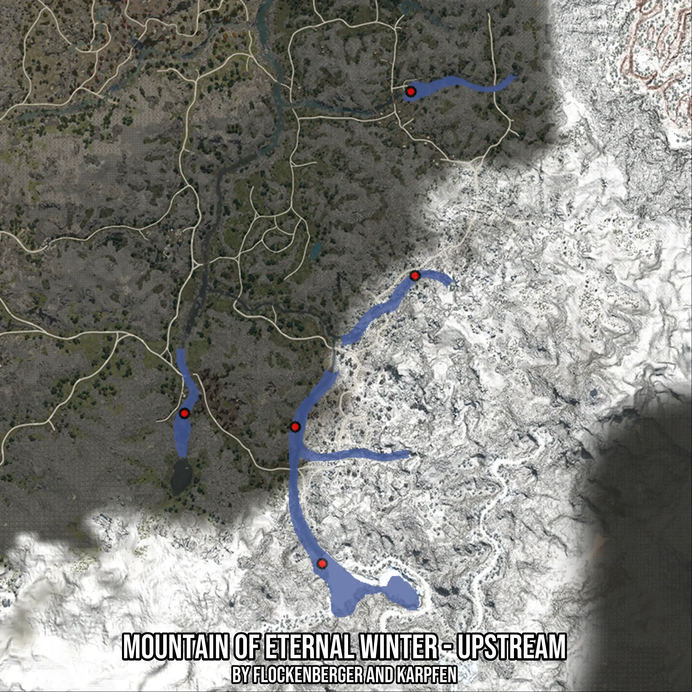

# Mountain of Eternal Winter - Upstream
Created by **flockenberger**

- **Red Points**: Exact in-game waypoints.
- **Colored Areas**: Entire area where the fishing table is consistent.
## ⚠️ Info about your float:
To verify your fishing position without modifying your files, you can do so [here](https://flockenberger.github.io/bdo-fish-position/).
- Or watch the guide [here](https://youtu.be/t-VXcRoNojk)

## Waypoints
Below you'll find the Copy-Paste ready XML file for this Fishing-Zone.

```xml
	<!--
		Waypoints for: Mountain of Eternal Winter - Upstream
		Auto-Generated by: flockenberger
		Preview at: https://github.com/Flockenberger/bdo-fish-waypoints/tree/main/Bookmark/Mountain%20of%20Eternal%20Winter%20-%20Upstream
	-->
	<WorldmapBookMark>
		<BookMark BookMarkName="1: Mountain of Eternal Winter - Upstream" PosX="132216.51322841644" PosY="0.0" PosZ="-502061.2263441086" />
		<BookMark BookMarkName="2: Mountain of Eternal Winter - Upstream" PosX="174983.57288837433" PosY="0.0" PosZ="-448150.63705444336" />
		<BookMark BookMarkName="3: Mountain of Eternal Winter - Upstream" PosX="92762.3948097229" PosY="0.0" PosZ="-497242.40272045135" />
		<BookMark BookMarkName="4: Mountain of Eternal Winter - Upstream" PosX="173477.69050598145" PosY="0.0" PosZ="-382494.16518211365" />
		<BookMark BookMarkName="5: Mountain of Eternal Winter - Upstream" PosX="141854.1604757309" PosY="0.0" PosZ="-550851.815533638" />
	</WorldmapBookMark>
```

## Usage Guide
[](https://youtu.be/W-bWmKdv8K8)

## Previews
     

 