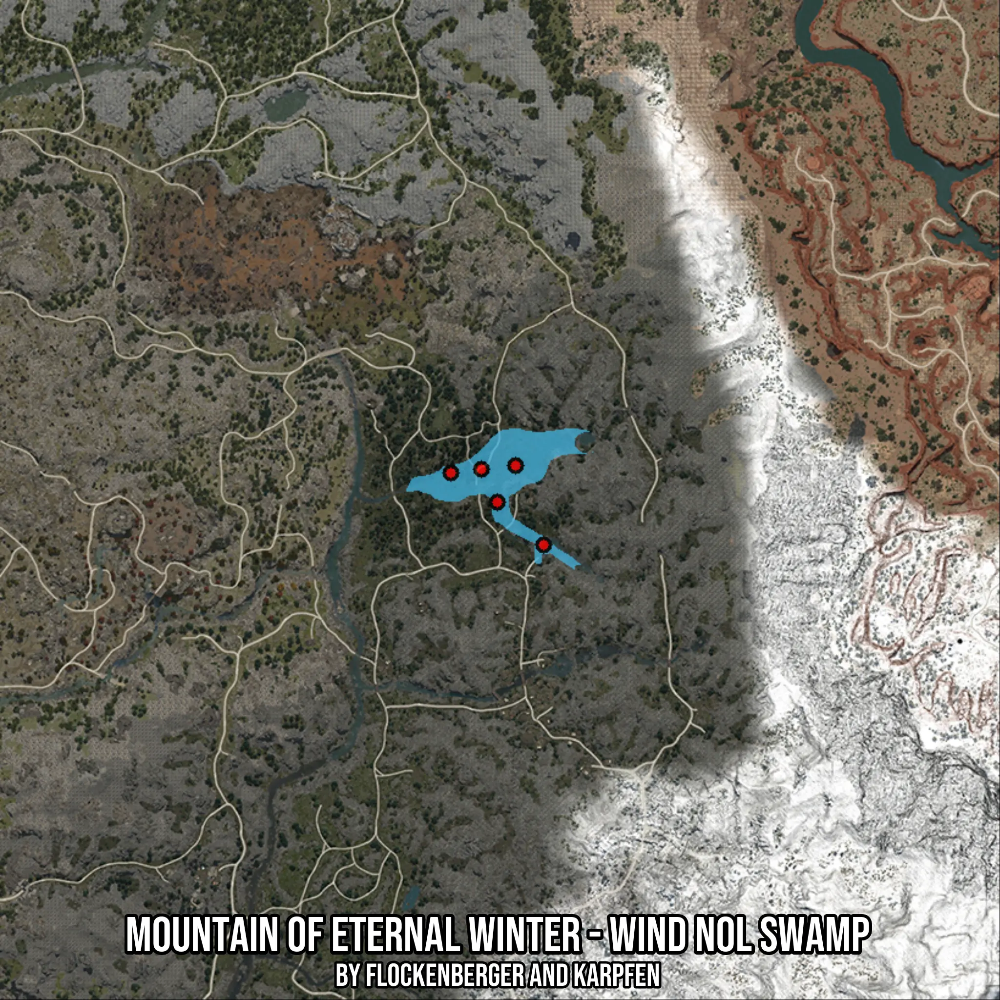

# Mountain of Eternal Winter - Wind Nol Swamp
Created by **flockenberger**

- **Red Points**: Exact in-game waypoints.
- **Colored Areas**: Entire area where the fishing table is consistent.
## ⚠️ Info about your float:
To verify your fishing position without modifying your files, you can do so [here](https://flockenberger.github.io/bdo-fish-position/).
- Or watch the guide [here](https://youtu.be/t-VXcRoNojk)

## Waypoints
Below you'll find the Copy-Paste ready XML file for this Fishing-Zone.

```xml
	<!--
		Waypoints for: Mountain of Eternal Winter - Wind Nol Swamp
		Auto-Generated by: flockenberger
		Preview at: https://github.com/Flockenberger/bdo-fish-waypoints/tree/main/Bookmark/Mountain%20of%20Eternal%20Winter%20-%20Wind%20Nol%20Swamp
	-->
	<WorldmapBookMark>
		<BookMark BookMarkName="1: Mountain of Eternal Winter - Wind Nol Swamp" PosX="172272.98460006714" PosY="0.0" PosZ="-352075.3410577774" />
		<BookMark BookMarkName="2: Mountain of Eternal Winter - Wind Nol Swamp" PosX="149383.5723876953" PosY="0.0" PosZ="-334305.9289455414" />
		<BookMark BookMarkName="3: Mountain of Eternal Winter - Wind Nol Swamp" PosX="160828.27849388123" PosY="0.0" PosZ="-341534.1643810272" />
		<BookMark BookMarkName="4: Mountain of Eternal Winter - Wind Nol Swamp" PosX="165345.92564105988" PosY="0.0" PosZ="-332498.8700866699" />
		<BookMark BookMarkName="5: Mountain of Eternal Winter - Wind Nol Swamp" PosX="156912.98429965973" PosY="0.0" PosZ="-333402.39951610565" />
	</WorldmapBookMark>
```

## Usage Guide
[](https://youtu.be/W-bWmKdv8K8)

## Previews
     

 