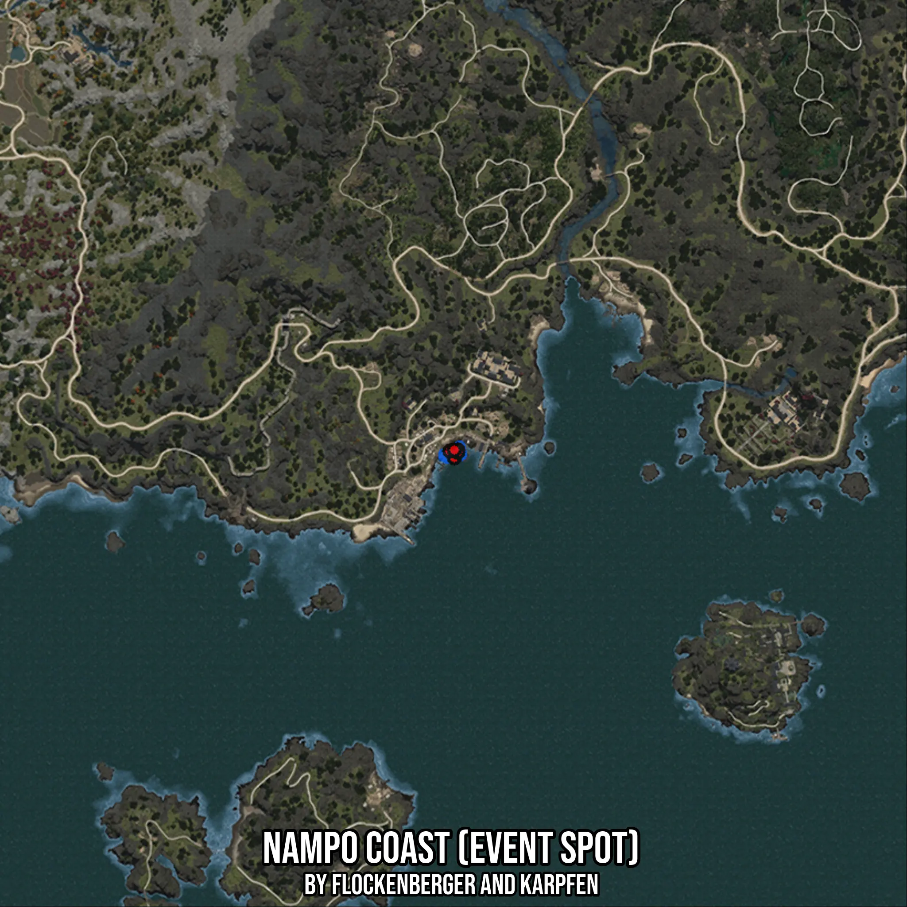

# Nampo Coast (Event Spot)
Created by **flockenberger**

- **Red Points**: Exact in-game waypoints.
- **Colored Areas**: Entire area where the fishing table is consistent.
## ⚠️ Info about your float:
To verify your fishing position without modifying your files, you can do so [here](https://flockenberger.github.io/bdo-fish-position/).
- Or watch the guide [here](https://youtu.be/t-VXcRoNojk)

## Waypoints
Below you'll find the Copy-Paste ready XML file for this Fishing-Zone.

```xml
	<!--
		Waypoints for: Nampo Coast (Event Spot)
		Auto-Generated by: flockenberger
		Preview at: https://github.com/Flockenberger/bdo-fish-waypoints/tree/main/Bookmark/Nampo%20Coast%20(Event%20Spot)
	-->
	<WorldmapBookMark>
		<BookMark BookMarkName="1: Nampo Coast (Event Spot)" PosX="-1304395.2795743942" PosY="-8175.0" PosZ="1129110.5702638626" />
		<BookMark BookMarkName="2: Nampo Coast (Event Spot)" PosX="-1303491.7501449585" PosY="-8175.0" PosZ="1131218.8055992126" />
		<BookMark BookMarkName="3: Nampo Coast (Event Spot)" PosX="-1305599.9854803085" PosY="-8175.0" PosZ="1130917.629122734" />
		<BookMark BookMarkName="4: Nampo Coast (Event Spot)" PosX="-1303491.7501449585" PosY="-8175.0" PosZ="1130616.4526462555" />
		<BookMark BookMarkName="5: Nampo Coast (Event Spot)" PosX="-1304395.2795743942" PosY="-8175.0" PosZ="1131218.8055992126" />
	</WorldmapBookMark>
```

## Usage Guide
[](https://youtu.be/W-bWmKdv8K8)

## Previews
     

 