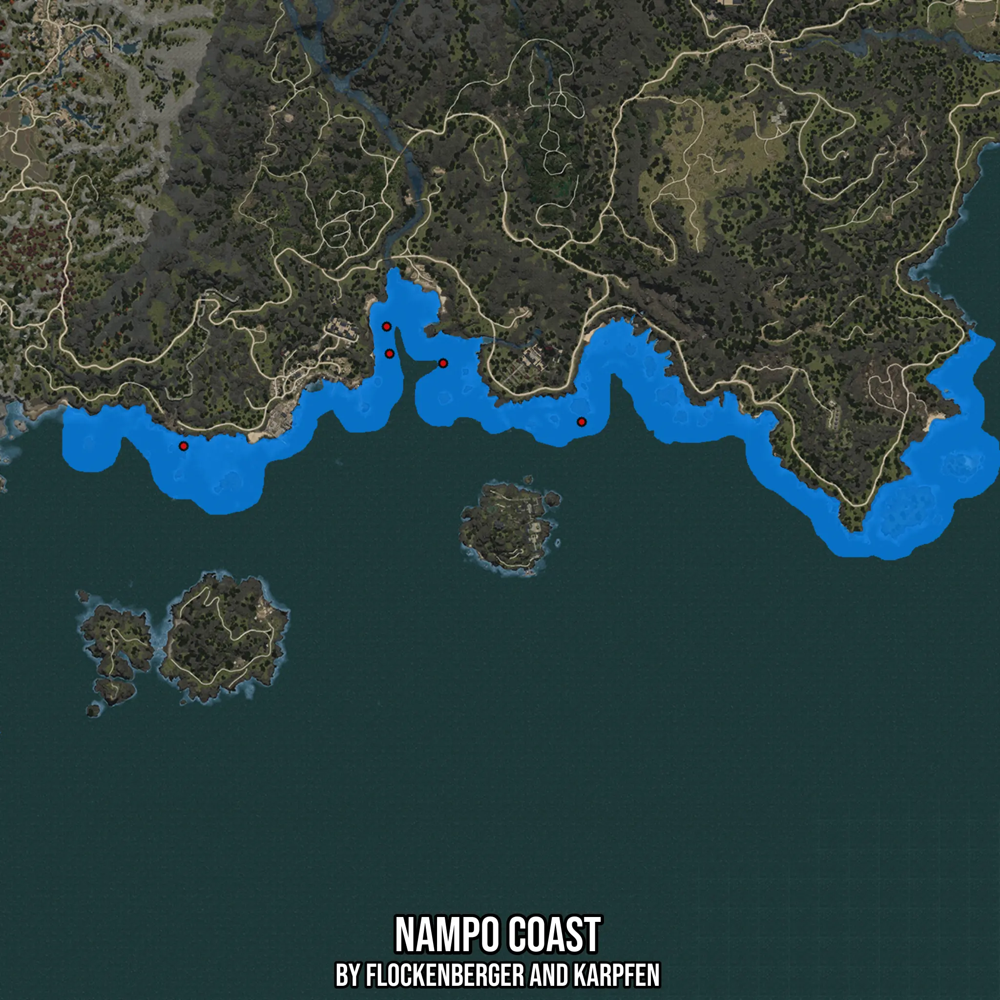

# Nampo Coast
Created by **flockenberger**

- **Red Points**: Exact in-game waypoints.
- **Colored Areas**: Entire area where the fishing table is consistent.
## ⚠️ Info about your float:
To verify your fishing position without modifying your files, you can do so [here](https://flockenberger.github.io/bdo-fish-position/).
- Or watch the guide [here](https://youtu.be/t-VXcRoNojk)

## Waypoints
Below you'll find the Copy-Paste ready XML file for this Fishing-Zone.

```xml
	<!--
		Waypoints for: Nampo Coast
		Auto-Generated by: flockenberger
		Preview at: https://github.com/Flockenberger/bdo-fish-waypoints/tree/main/Bookmark/Nampo%20Coast
	-->
	<WorldmapBookMark>
		<BookMark BookMarkName="1: Nampo Coast" PosX="-1273675.2789735794" PosY="0.0" PosZ="1143265.8646583557" />
		<BookMark BookMarkName="2: Nampo Coast" PosX="-1251689.3961906433" PosY="-8175.0" PosZ="1139350.5704641342" />
		<BookMark BookMarkName="3: Nampo Coast" PosX="-1274879.9848794937" PosY="0.0" PosZ="1154409.394288063" />
		<BookMark BookMarkName="4: Nampo Coast" PosX="-1358305.8688640594" PosY="0.0" PosZ="1105317.628622055" />
		<BookMark BookMarkName="5: Nampo Coast" PosX="-1194767.0421361923" PosY="-8175.0" PosZ="1115256.452345848" />
	</WorldmapBookMark>
```

## Usage Guide
[](https://youtu.be/W-bWmKdv8K8)

## Previews
     

 