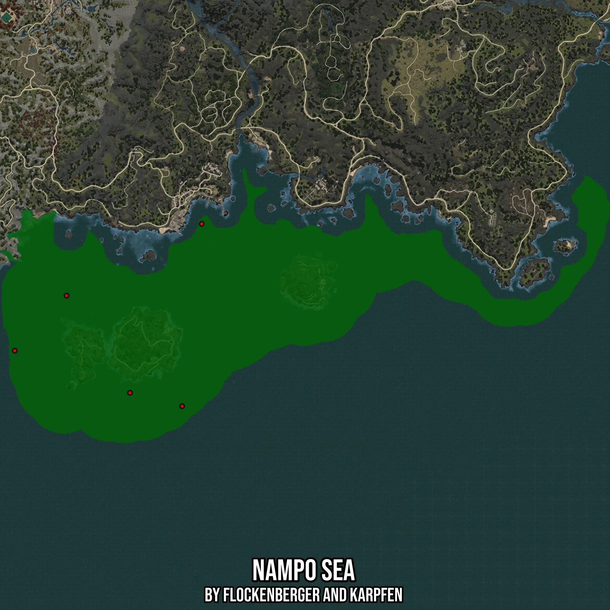

# Nampo Sea
Created by **flockenberger**

- **Red Points**: Exact in-game waypoints.
- **Colored Areas**: Entire area where the fishing table is consistent.
## ⚠️ Info about your float:
To verify your fishing position without modifying your files, you can do so [here](https://flockenberger.github.io/bdo-fish-position/).
- Or watch the guide [here](https://youtu.be/t-VXcRoNojk)

## Waypoints
Below you'll find the Copy-Paste ready XML file for this Fishing-Zone.

```xml
	<!--
		Waypoints for: Nampo Sea
		Auto-Generated by: flockenberger
		Preview at: https://github.com/Flockenberger/bdo-fish-waypoints/tree/main/Bookmark/Nampo%20Sea
	-->
	<WorldmapBookMark>
		<BookMark BookMarkName="1: Nampo Sea" PosX="-1398663.5167121887" PosY="-8175.0" PosZ="1061948.21600914" />
		<BookMark BookMarkName="2: Nampo Sea" PosX="-1315237.632727623" PosY="-8175.0" PosZ="982136.4497423172" />
		<BookMark BookMarkName="3: Nampo Sea" PosX="-1436009.3997955322" PosY="-8175.0" PosZ="1022192.9211139679" />
		<BookMark BookMarkName="4: Nampo Sea" PosX="-1301082.3383331299" PosY="-8175.0" PosZ="1113750.5699634552" />
		<BookMark BookMarkName="5: Nampo Sea" PosX="-1352884.692287445" PosY="-8175.0" PosZ="991774.0969896317" />
	</WorldmapBookMark>
```

## Usage Guide
[](https://youtu.be/W-bWmKdv8K8)

## Previews
     

 