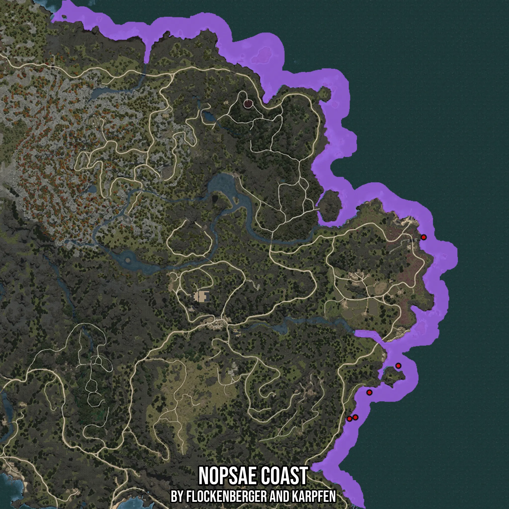

# Nopsae Coast
Created by **flockenberger**

- **Red Points**: Exact in-game waypoints.
- **Colored Areas**: Entire area where the fishing table is consistent.
## ⚠️ Info about your float:
To verify your fishing position without modifying your files, you can do so [here](https://flockenberger.github.io/bdo-fish-position/).
- Or watch the guide [here](https://youtu.be/t-VXcRoNojk)

## Waypoints
Below you'll find the Copy-Paste ready XML file for this Fishing-Zone.

```xml
	<!--
		Waypoints for: Nopsae Coast
		Auto-Generated by: flockenberger
		Preview at: https://github.com/Flockenberger/bdo-fish-waypoints/tree/main/Bookmark/Nopsae%20Coast
	-->
	<WorldmapBookMark>
		<BookMark BookMarkName="1: Nopsae Coast" PosX="-1036047.0390319824" PosY="0.0" PosZ="1208922.3365306854" />
		<BookMark BookMarkName="2: Nopsae Coast" PosX="-1022795.274066925" PosY="0.0" PosZ="1226390.5721664429" />
		<BookMark BookMarkName="3: Nopsae Coast" PosX="-1032131.7448377609" PosY="0.0" PosZ="1209825.8659601212" />
		<BookMark BookMarkName="4: Nopsae Coast" PosX="-1003519.9795722961" PosY="0.0" PosZ="1244159.984278679" />
		<BookMark BookMarkName="5: Nopsae Coast" PosX="-986654.0968894958" PosY="0.0" PosZ="1329694.1035985947" />
	</WorldmapBookMark>
```

## Usage Guide
[](https://youtu.be/W-bWmKdv8K8)

## Previews
     

 