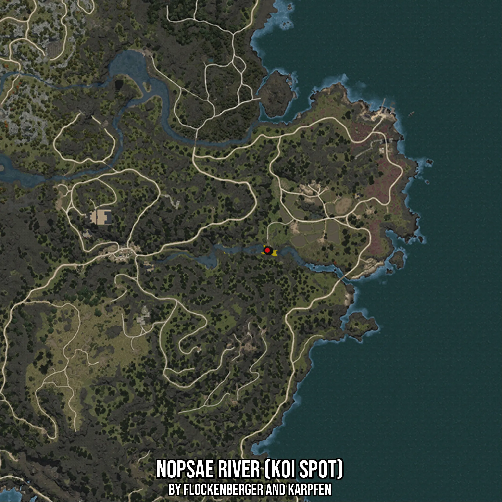

# Nopsae River (Koi Spot)
Created by **flockenberger**

- **Red Points**: Exact in-game waypoints.
- **Colored Areas**: Entire area where the fishing table is consistent.
## ⚠️ Info about your float:
To verify your fishing position without modifying your files, you can do so [here](https://flockenberger.github.io/bdo-fish-position/).
- Or watch the guide [here](https://youtu.be/t-VXcRoNojk)

## Waypoints
Below you'll find the Copy-Paste ready XML file for this Fishing-Zone.

```xml
	<!--
		Waypoints for: Nopsae River (Koi Spot)
		Auto-Generated by: flockenberger
		Preview at: https://github.com/Flockenberger/bdo-fish-waypoints/tree/main/Bookmark/Nopsae%20River%20(Koi%20Spot)
	-->
	<WorldmapBookMark>
		<BookMark BookMarkName="1: Nopsae River (Koi Spot)" PosX="-1051708.2158088684" PosY="0.0" PosZ="1273675.2789735794" />
		<BookMark BookMarkName="2: Nopsae River (Koi Spot)" PosX="-1052611.7452383041" PosY="0.0" PosZ="1273976.455450058" />
		<BookMark BookMarkName="3: Nopsae River (Koi Spot)" PosX="-1052310.5687618256" PosY="0.0" PosZ="1273675.2789735794" />
		<BookMark BookMarkName="4: Nopsae River (Koi Spot)" PosX="-1052611.7452383041" PosY="0.0" PosZ="1273976.455450058" />
		<BookMark BookMarkName="5: Nopsae River (Koi Spot)" PosX="-1052611.7452383041" PosY="0.0" PosZ="1273976.455450058" />
	</WorldmapBookMark>
```

## Usage Guide
[](https://youtu.be/W-bWmKdv8K8)

## Previews
     

 