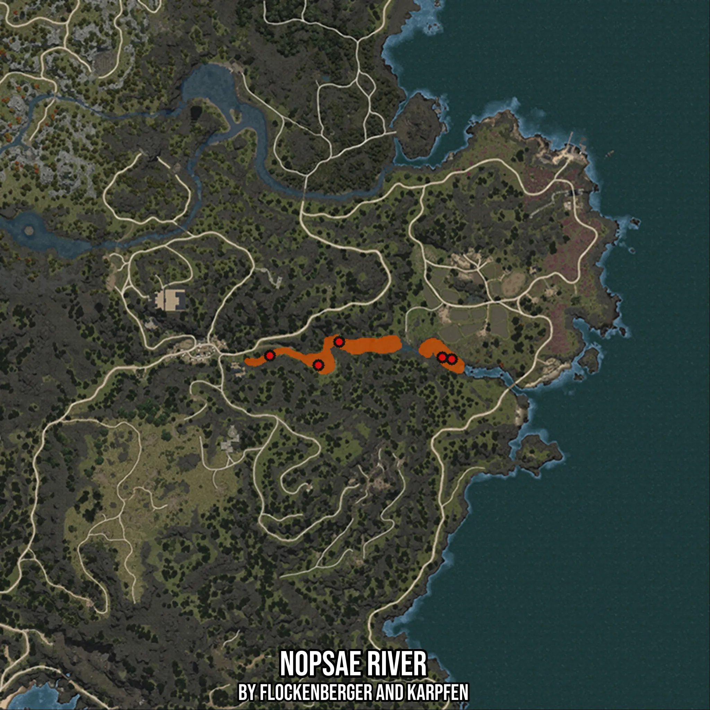

# Nopsae River
Created by **flockenberger**

- **Red Points**: Exact in-game waypoints.
- **Colored Areas**: Entire area where the fishing table is consistent.
## ⚠️ Info about your float:
To verify your fishing position without modifying your files, you can do so [here](https://flockenberger.github.io/bdo-fish-position/).
- Or watch the guide [here](https://youtu.be/t-VXcRoNojk)

## Waypoints
Below you'll find the Copy-Paste ready XML file for this Fishing-Zone.

```xml
	<!--
		Waypoints for: Nopsae River
		Auto-Generated by: flockenberger
		Preview at: https://github.com/Flockenberger/bdo-fish-waypoints/tree/main/Bookmark/Nopsae%20River
	-->
	<WorldmapBookMark>
		<BookMark BookMarkName="1: Nopsae River" PosX="-1075802.3339271545" PosY="0.0" PosZ="1275783.5143089294" />
		<BookMark BookMarkName="2: Nopsae River" PosX="-1039962.3332262039" PosY="0.0" PosZ="1270362.337732315" />
		<BookMark BookMarkName="3: Nopsae River" PosX="-1099896.4520454407" PosY="0.0" PosZ="1270964.6906852722" />
		<BookMark BookMarkName="4: Nopsae River" PosX="-1083030.5693626404" PosY="0.0" PosZ="1267651.7494440079" />
		<BookMark BookMarkName="5: Nopsae River" PosX="-1036649.3919849396" PosY="0.0" PosZ="1269759.984779358" />
	</WorldmapBookMark>
```

## Usage Guide
[](https://youtu.be/W-bWmKdv8K8)

## Previews
     

 