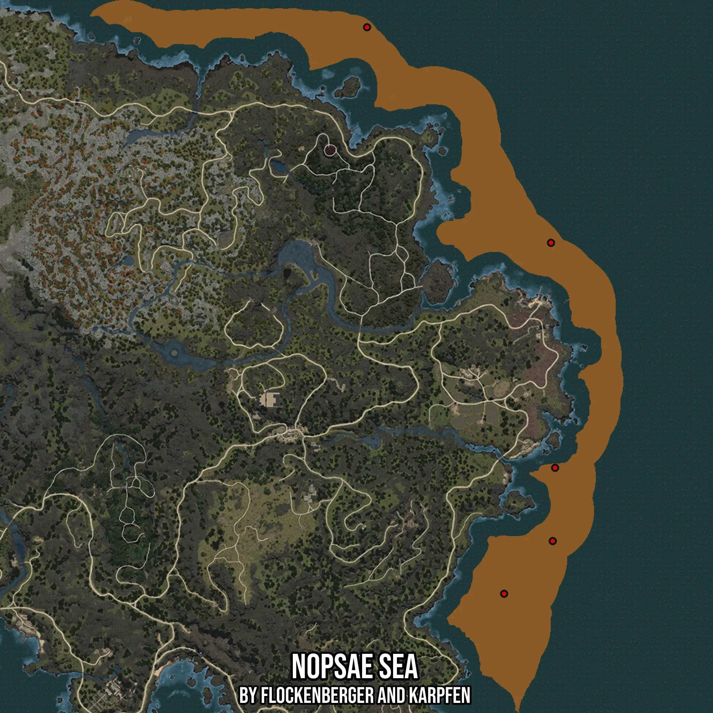

# Nopsae Sea
Created by **flockenberger**

- **Red Points**: Exact in-game waypoints.
- **Colored Areas**: Entire area where the fishing table is consistent.
## ⚠️ Info about your float:
To verify your fishing position without modifying your files, you can do so [here](https://flockenberger.github.io/bdo-fish-position/).
- Or watch the guide [here](https://youtu.be/t-VXcRoNojk)

## Waypoints
Below you'll find the Copy-Paste ready XML file for this Fishing-Zone.

```xml
	<!--
		Waypoints for: Nopsae Sea
		Auto-Generated by: flockenberger
		Preview at: https://github.com/Flockenberger/bdo-fish-waypoints/tree/main/Bookmark/Nopsae%20Sea
	-->
	<WorldmapBookMark>
		<BookMark BookMarkName="1: Nopsae Sea" PosX="-987858.8027954102" PosY="-8175.0" PosZ="1255303.5139083862" />
		<BookMark BookMarkName="2: Nopsae Sea" PosX="-989967.0381307602" PosY="-8175.0" PosZ="1370955.2808761597" />
		<BookMark BookMarkName="3: Nopsae Sea" PosX="-1014061.1562490463" PosY="-8175.0" PosZ="1190550.5714654922" />
		<BookMark BookMarkName="4: Nopsae Sea" PosX="-1084536.4517450333" PosY="-8175.0" PosZ="1481788.2242202759" />
		<BookMark BookMarkName="5: Nopsae Sea" PosX="-989063.5087013245" PosY="-8175.0" PosZ="1217656.4543485641" />
	</WorldmapBookMark>
```

## Usage Guide
[](https://youtu.be/W-bWmKdv8K8)

## Previews
     

 