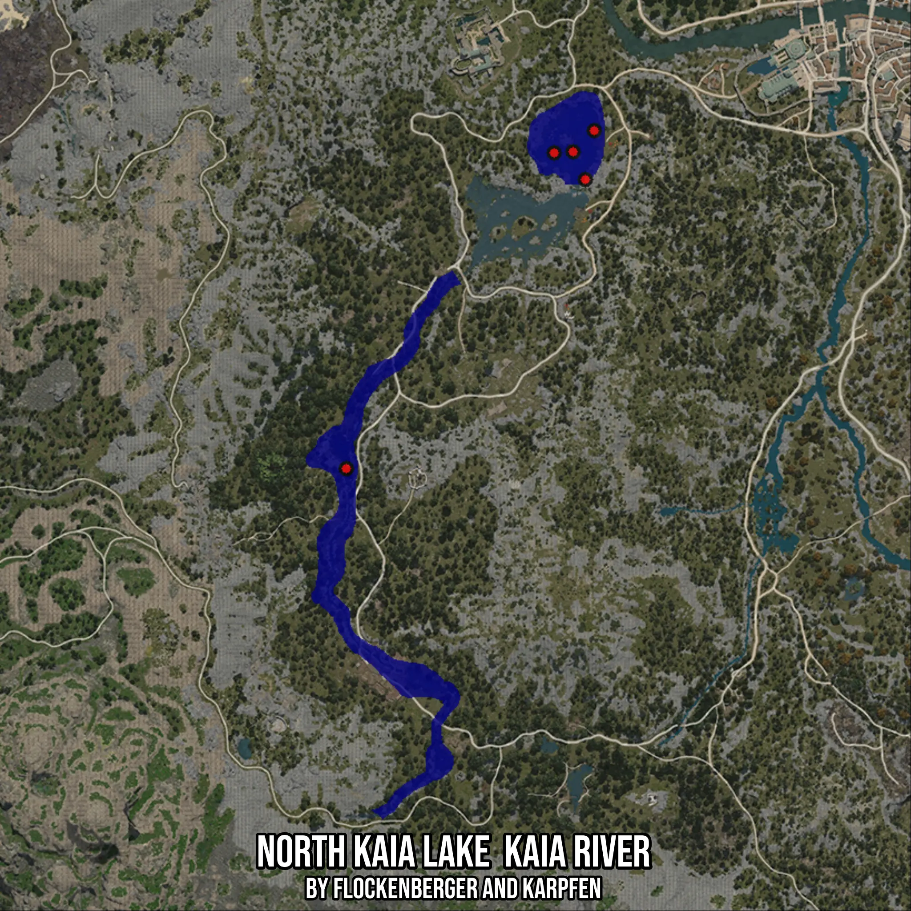

# North Kaia Lake  Kaia River
Created by **flockenberger**

- **Red Points**: Exact in-game waypoints.
- **Colored Areas**: Entire area where the fishing table is consistent.
## ⚠️ Info about your float:
To verify your fishing position without modifying your files, you can do so [here](https://flockenberger.github.io/bdo-fish-position/).
- Or watch the guide [here](https://youtu.be/t-VXcRoNojk)

## Waypoints
Below you'll find the Copy-Paste ready XML file for this Fishing-Zone.

```xml
	<!--
		Waypoints for: North Kaia Lake  Kaia River
		Auto-Generated by: flockenberger
		Preview at: https://github.com/Flockenberger/bdo-fish-waypoints/tree/main/Bookmark/North%20Kaia%20Lake%20%20Kaia%20River
	-->
	<WorldmapBookMark>
		<BookMark BookMarkName="1: North Kaia Lake  Kaia River" PosX="-388216.438126564" PosY="0.0" PosZ="-174381.21993541718" />
		<BookMark BookMarkName="2: North Kaia Lake  Kaia River" PosX="-321054.08387184143" PosY="0.0" PosZ="-82823.57108592987" />
		<BookMark BookMarkName="3: North Kaia Lake  Kaia River" PosX="-323463.49568367004" PosY="0.0" PosZ="-96075.33605098724" />
		<BookMark BookMarkName="4: North Kaia Lake  Kaia River" PosX="-326776.4369249344" PosY="0.0" PosZ="-88545.92413902283" />
		<BookMark BookMarkName="5: North Kaia Lake  Kaia River" PosX="-331896.4370250702" PosY="0.0" PosZ="-88847.1006155014" />
	</WorldmapBookMark>
```

## Usage Guide
[](https://youtu.be/W-bWmKdv8K8)

## Previews
     

 