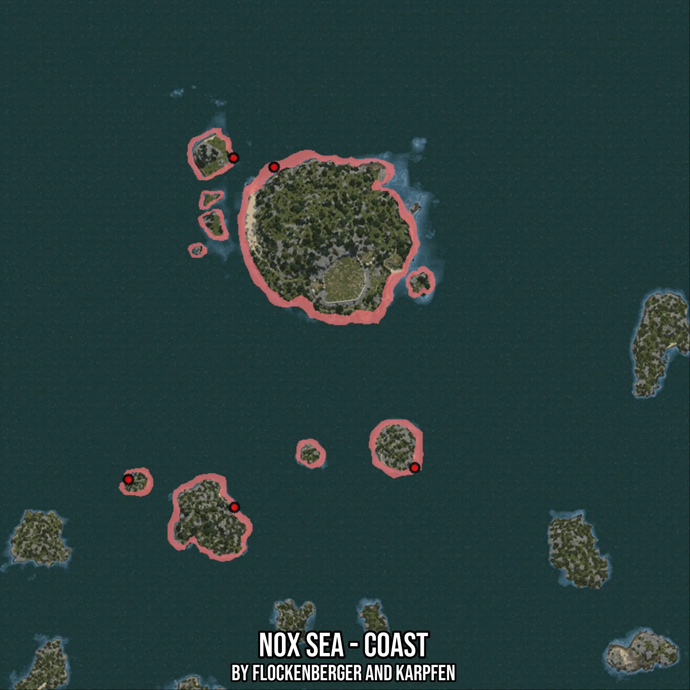

# Nox Sea - Coast
Created by **flockenberger**

- **Red Points**: Exact in-game waypoints.
- **Colored Areas**: Entire area where the fishing table is consistent.
## ⚠️ Info about your float:
To verify your fishing position without modifying your files, you can do so [here](https://flockenberger.github.io/bdo-fish-position/).
- Or watch the guide [here](https://youtu.be/t-VXcRoNojk)

## Waypoints
Below you'll find the Copy-Paste ready XML file for this Fishing-Zone.

```xml
	<!--
		Waypoints for: Nox Sea - Coast
		Auto-Generated by: flockenberger
		Preview at: https://github.com/Flockenberger/bdo-fish-waypoints/tree/main/Bookmark/Nox%20Sea%20-%20Coast
	-->
	<WorldmapBookMark>
		<BookMark BookMarkName="1: Nox Sea - Coast" PosX="-99689.37366008759" PosY="-8175.0" PosZ="428875.2624511719" />
		<BookMark BookMarkName="2: Nox Sea - Coast" PosX="-113844.66805458069" PosY="-8175.0" PosZ="307199.9659538269" />
		<BookMark BookMarkName="3: Nox Sea - Coast" PosX="-49392.90208816528" PosY="-8175.0" PosZ="321355.26034832" />
		<BookMark BookMarkName="4: Nox Sea - Coast" PosX="-114145.84453105927" PosY="-8175.0" PosZ="432188.2036924362" />
		<BookMark BookMarkName="5: Nox Sea - Coast" PosX="-151792.90409088135" PosY="-8175.0" PosZ="317138.78967761993" />
	</WorldmapBookMark>
```

## Usage Guide
[](https://youtu.be/W-bWmKdv8K8)

## Previews
     

 