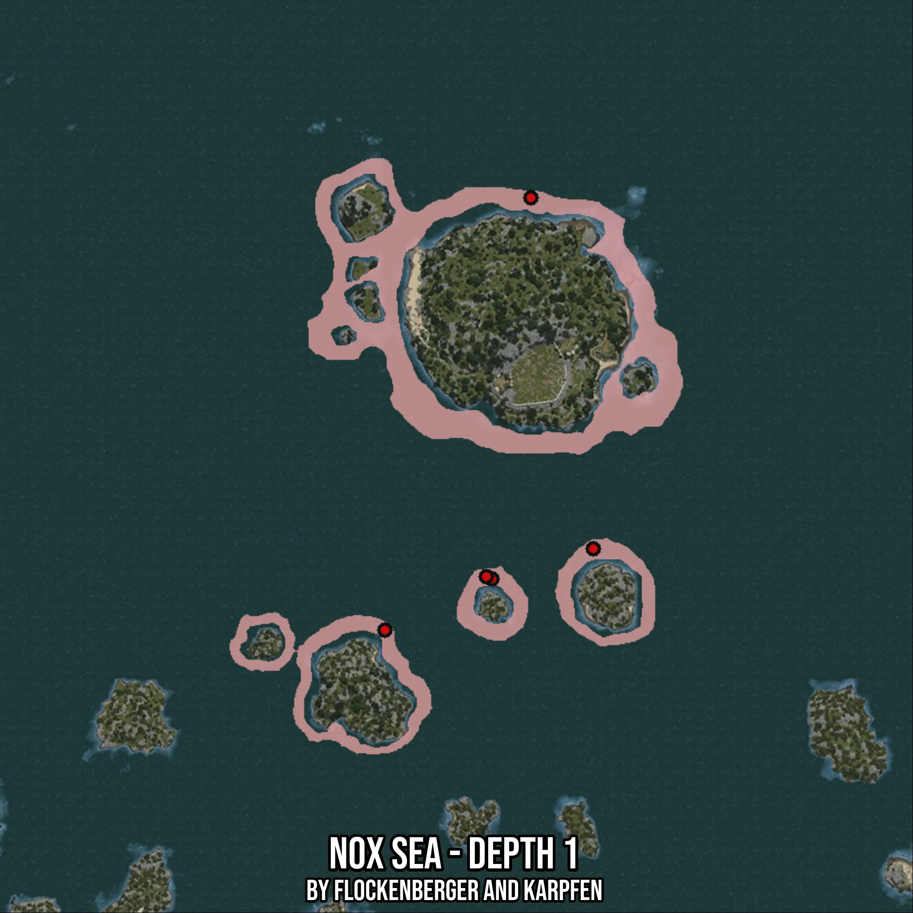

# Nox Sea - Depth 1
Created by **flockenberger**

- **Red Points**: Exact in-game waypoints.
- **Colored Areas**: Entire area where the fishing table is consistent.
## ⚠️ Info about your float:
To verify your fishing position without modifying your files, you can do so [here](https://flockenberger.github.io/bdo-fish-position/).
- Or watch the guide [here](https://youtu.be/t-VXcRoNojk)

## Waypoints
Below you'll find the Copy-Paste ready XML file for this Fishing-Zone.

```xml
	<!--
		Waypoints for: Nox Sea - Depth 1
		Auto-Generated by: flockenberger
		Preview at: https://github.com/Flockenberger/bdo-fish-waypoints/tree/main/Bookmark/Nox%20Sea%20-%20Depth%201
	-->
	<WorldmapBookMark>
		<BookMark BookMarkName="1: Nox Sea - Depth 1" PosX="-76498.78497123718" PosY="-8175.0" PosZ="436404.6743631363" />
		<BookMark BookMarkName="2: Nox Sea - Depth 1" PosX="-115952.90338993073" PosY="-8175.0" PosZ="319548.20148944855" />
		<BookMark BookMarkName="3: Nox Sea - Depth 1" PosX="-59632.90228843689" PosY="-8175.0" PosZ="341534.08427238464" />
		<BookMark BookMarkName="4: Nox Sea - Depth 1" PosX="-87039.96164798737" PosY="-8175.0" PosZ="333402.3194074631" />
		<BookMark BookMarkName="5: Nox Sea - Depth 1" PosX="-88545.84403038025" PosY="-8175.0" PosZ="334004.6723604202" />
	</WorldmapBookMark>
```

## Usage Guide
[](https://youtu.be/W-bWmKdv8K8)

## Previews
     

 