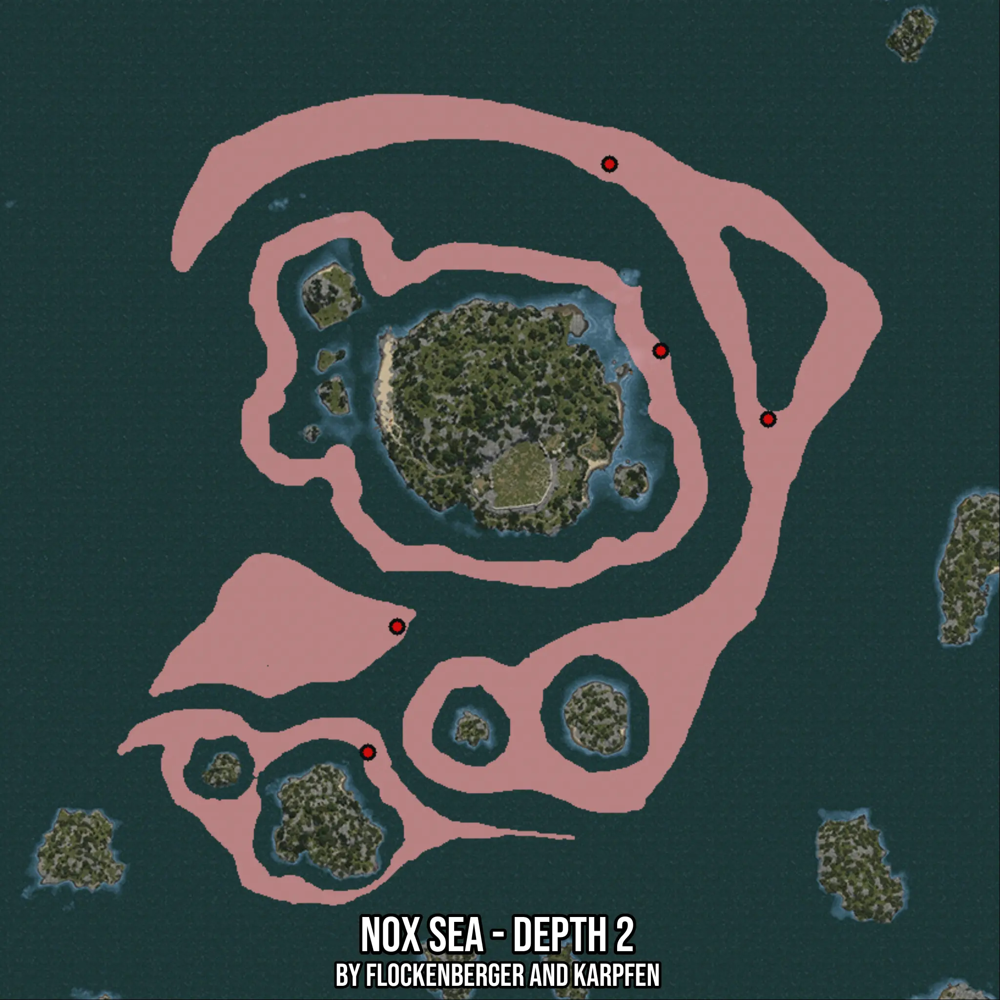

# Nox Sea - Depth 2
Created by **flockenberger**

- **Red Points**: Exact in-game waypoints.
- **Colored Areas**: Entire area where the fishing table is consistent.
## ⚠️ Info about your float:
To verify your fishing position without modifying your files, you can do so [here](https://flockenberger.github.io/bdo-fish-position/).
- Or watch the guide [here](https://youtu.be/t-VXcRoNojk)

## Waypoints
Below you'll find the Copy-Paste ready XML file for this Fishing-Zone.

```xml
	<!--
		Waypoints for: Nox Sea - Depth 2
		Auto-Generated by: flockenberger
		Preview at: https://github.com/Flockenberger/bdo-fish-waypoints/tree/main/Bookmark/Nox%20Sea%20-%20Depth%202
	-->
	<WorldmapBookMark>
		<BookMark BookMarkName="1: Nox Sea - Depth 2" PosX="-13552.90138721466" PosY="-8175.0" PosZ="402371.7325210571" />
		<BookMark BookMarkName="2: Nox Sea - Depth 2" PosX="-40056.43131732941" PosY="-8175.0" PosZ="419237.6152038574" />
		<BookMark BookMarkName="3: Nox Sea - Depth 2" PosX="-105110.55023670197" PosY="-8175.0" PosZ="351171.7315196991" />
		<BookMark BookMarkName="4: Nox Sea - Depth 2" PosX="-112338.7856721878" PosY="-8175.0" PosZ="320150.5544424057" />
		<BookMark BookMarkName="5: Nox Sea - Depth 2" PosX="-52705.84332942963" PosY="-8175.0" PosZ="465317.61610507965" />
	</WorldmapBookMark>
```

## Usage Guide
[](https://youtu.be/W-bWmKdv8K8)

## Previews
     

 