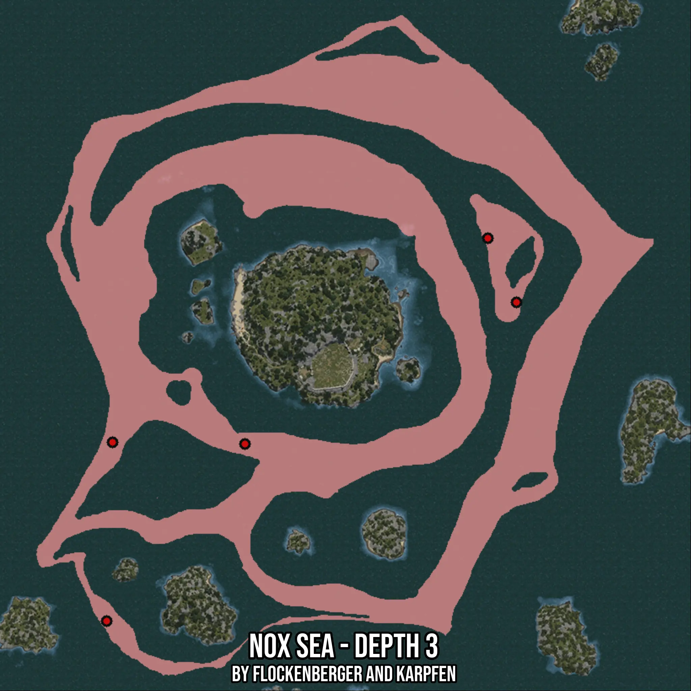

# Nox Sea - Depth 3
Created by **flockenberger**

- **Red Points**: Exact in-game waypoints.
- **Colored Areas**: Entire area where the fishing table is consistent.
## ⚠️ Info about your float:
To verify your fishing position without modifying your files, you can do so [here](https://flockenberger.github.io/bdo-fish-position/).
- Or watch the guide [here](https://youtu.be/t-VXcRoNojk)

## Waypoints
Below you'll find the Copy-Paste ready XML file for this Fishing-Zone.

```xml
	<!--
		Waypoints for: Nox Sea - Depth 3
		Auto-Generated by: flockenberger
		Preview at: https://github.com/Flockenberger/bdo-fish-waypoints/tree/main/Bookmark/Nox%20Sea%20-%20Depth%203
	-->
	<WorldmapBookMark>
		<BookMark BookMarkName="1: Nox Sea - Depth 3" PosX="-105712.90318965912" PosY="-8175.0" PosZ="360809.37876701355" />
		<BookMark BookMarkName="2: Nox Sea - Depth 3" PosX="-8734.077763557434" PosY="-8175.0" PosZ="411407.0268154144" />
		<BookMark BookMarkName="3: Nox Sea - Depth 3" PosX="-18974.07796382904" PosY="-8175.0" PosZ="434296.43902778625" />
		<BookMark BookMarkName="4: Nox Sea - Depth 3" PosX="-155105.8453321457" PosY="-8175.0" PosZ="297562.31870651245" />
		<BookMark BookMarkName="5: Nox Sea - Depth 3" PosX="-152997.60999679565" PosY="-8175.0" PosZ="361411.7317199707" />
	</WorldmapBookMark>
```

## Usage Guide
[](https://youtu.be/W-bWmKdv8K8)

## Previews
     

 