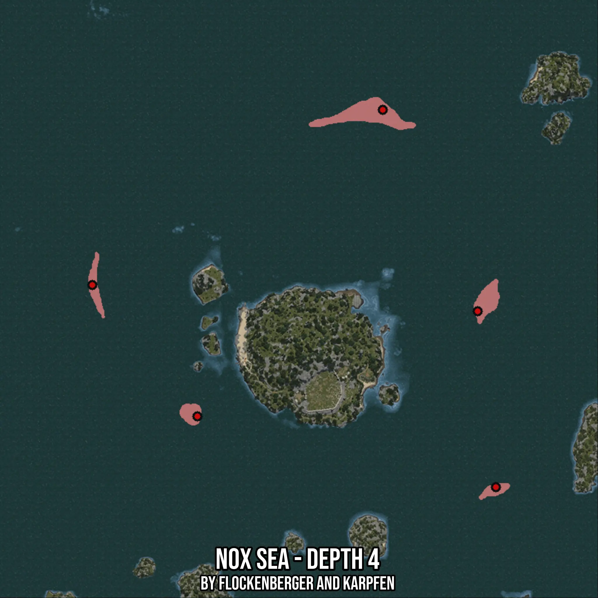

# Nox Sea - Depth 4
Created by **flockenberger**

- **Red Points**: Exact in-game waypoints.
- **Colored Areas**: Entire area where the fishing table is consistent.
## ⚠️ Info about your float:
To verify your fishing position without modifying your files, you can do so [here](https://flockenberger.github.io/bdo-fish-position/).
- Or watch the guide [here](https://youtu.be/t-VXcRoNojk)

## Waypoints
Below you'll find the Copy-Paste ready XML file for this Fishing-Zone.

```xml
	<!--
		Waypoints for: Nox Sea - Depth 4
		Auto-Generated by: flockenberger
		Preview at: https://github.com/Flockenberger/bdo-fish-waypoints/tree/main/Bookmark/Nox%20Sea%20-%20Depth%204
	-->
	<WorldmapBookMark>
		<BookMark BookMarkName="1: Nox Sea - Depth 4" PosX="-49995.25504112244" PosY="-8175.0" PosZ="504771.7345237732" />
		<BookMark BookMarkName="2: Nox Sea - Depth 4" PosX="-10842.31309890747" PosY="-8175.0" PosZ="421647.02701568604" />
		<BookMark BookMarkName="3: Nox Sea - Depth 4" PosX="-169863.49267959595" PosY="-8175.0" PosZ="432489.3801689148" />
		<BookMark BookMarkName="4: Nox Sea - Depth 4" PosX="-126494.08006668091" PosY="-8175.0" PosZ="378277.614402771" />
		<BookMark BookMarkName="5: Nox Sea - Depth 4" PosX="-3312.901186943054" PosY="-8175.0" PosZ="349063.49618434906" />
	</WorldmapBookMark>
```

## Usage Guide
[](https://youtu.be/W-bWmKdv8K8)

## Previews
     

 