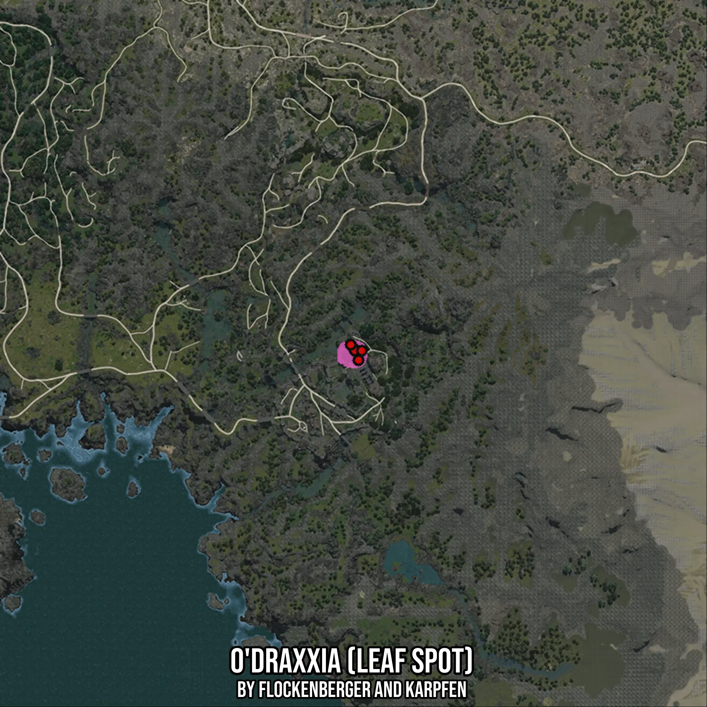

# O'draxxia (Leaf Spot)
Created by **flockenberger**

- **Red Points**: Exact in-game waypoints.
- **Colored Areas**: Entire area where the fishing table is consistent.
## ⚠️ Info about your float:
To verify your fishing position without modifying your files, you can do so [here](https://flockenberger.github.io/bdo-fish-position/).
- Or watch the guide [here](https://youtu.be/t-VXcRoNojk)

## Waypoints
Below you'll find the Copy-Paste ready XML file for this Fishing-Zone.

```xml
	<!--
		Waypoints for: O'draxxia (Leaf Spot)
		Auto-Generated by: flockenberger
		Preview at: https://github.com/Flockenberger/bdo-fish-waypoints/tree/main/Bookmark/O'draxxia%20(Leaf%20Spot)
	-->
	<WorldmapBookMark>
		<BookMark BookMarkName="1: O'draxxia (Leaf Spot)" PosX="-150588.19818496704" PosY="0.0" PosZ="-585788.2868051529" />
		<BookMark BookMarkName="2: O'draxxia (Leaf Spot)" PosX="-149082.31580257416" PosY="0.0" PosZ="-589703.5809993744" />
		<BookMark BookMarkName="3: O'draxxia (Leaf Spot)" PosX="-150287.02170848846" PosY="0.0" PosZ="-586390.63975811" />
		<BookMark BookMarkName="4: O'draxxia (Leaf Spot)" PosX="-147877.60989665985" PosY="0.0" PosZ="-586390.63975811" />
		<BookMark BookMarkName="5: O'draxxia (Leaf Spot)" PosX="-151792.90409088135" PosY="0.0" PosZ="-584282.40442276" />
	</WorldmapBookMark>
```

## Usage Guide
[](https://youtu.be/W-bWmKdv8K8)

## Previews
     

 