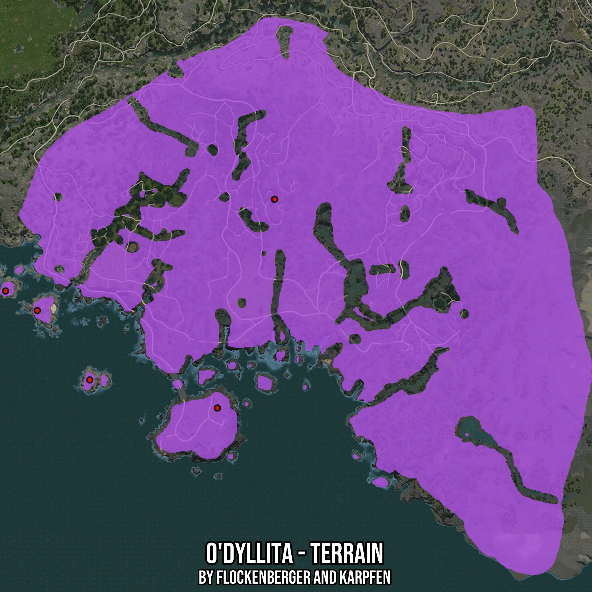

# O'dyllita - Terrain
Created by **flockenberger**

- **Red Points**: Exact in-game waypoints.
- **Colored Areas**: Entire area where the fishing table is consistent.
## ⚠️ Info about your float:
To verify your fishing position without modifying your files, you can do so [here](https://flockenberger.github.io/bdo-fish-position/).
- Or watch the guide [here](https://youtu.be/t-VXcRoNojk)

## Waypoints
Below you'll find the Copy-Paste ready XML file for this Fishing-Zone.

```xml
	<!--
		Waypoints for: O'dyllita - Terrain
		Auto-Generated by: flockenberger
		Preview at: https://github.com/Flockenberger/bdo-fish-waypoints/tree/main/Bookmark/O'dyllita%20-%20Terrain
	-->
	<WorldmapBookMark>
		<BookMark BookMarkName="1: O'dyllita - Terrain" PosX="-245759.96475219727" PosY="0.0" PosZ="-528564.7562742233" />
		<BookMark BookMarkName="2: O'dyllita - Terrain" PosX="-278287.02421188354" PosY="-8175.0" PosZ="-647228.2880067825" />
		<BookMark BookMarkName="3: O'dyllita - Terrain" PosX="-380687.0262145996" PosY="-8175.0" PosZ="-591811.8163347244" />
		<BookMark BookMarkName="4: O'dyllita - Terrain" PosX="-350870.5550432205" PosY="-8175.0" PosZ="-631265.934753418" />
		<BookMark BookMarkName="5: O'dyllita - Terrain" PosX="-398757.6148033142" PosY="-8175.0" PosZ="-580668.2867050171" />
	</WorldmapBookMark>
```

## Usage Guide
[](https://youtu.be/W-bWmKdv8K8)

## Previews
     

 