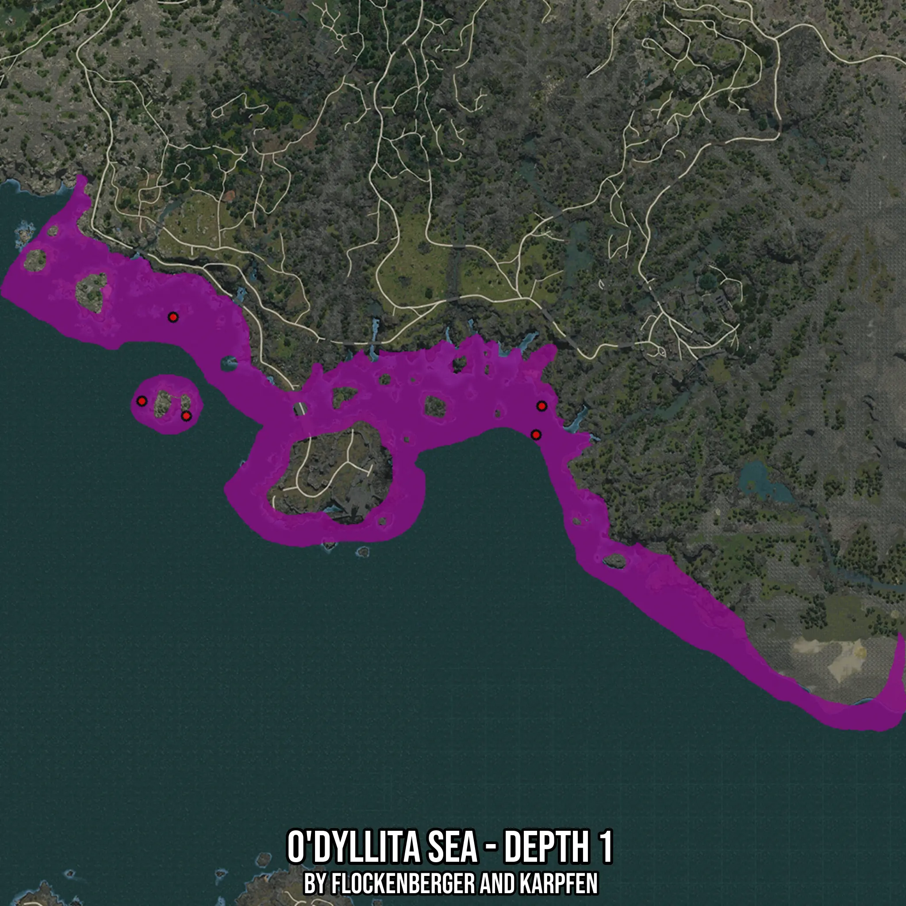

# O'dyllita Sea - Depth 1
Created by **flockenberger**

- **Red Points**: Exact in-game waypoints.
- **Colored Areas**: Entire area where the fishing table is consistent.
## ⚠️ Info about your float:
To verify your fishing position without modifying your files, you can do so [here](https://flockenberger.github.io/bdo-fish-position/).
- Or watch the guide [here](https://youtu.be/t-VXcRoNojk)

## Waypoints
Below you'll find the Copy-Paste ready XML file for this Fishing-Zone.

```xml
	<!--
		Waypoints for: O'dyllita Sea - Depth 1
		Auto-Generated by: flockenberger
		Preview at: https://github.com/Flockenberger/bdo-fish-waypoints/tree/main/Bookmark/O'dyllita%20Sea%20-%20Depth%201
	-->
	<WorldmapBookMark>
		<BookMark BookMarkName="1: O'dyllita Sea - Depth 1" PosX="-347256.4373254776" PosY="-8175.0" PosZ="-600244.7576761246" />
		<BookMark BookMarkName="2: O'dyllita Sea - Depth 1" PosX="-358701.1434316635" PosY="-8175.0" PosZ="-630964.7582769394" />
		<BookMark BookMarkName="3: O'dyllita Sea - Depth 1" PosX="-342437.6137018204" PosY="-8175.0" PosZ="-636385.9348535538" />
		<BookMark BookMarkName="4: O'dyllita Sea - Depth 1" PosX="-212329.37586307526" PosY="-8175.0" PosZ="-632771.8171358109" />
		<BookMark BookMarkName="5: O'dyllita Sea - Depth 1" PosX="-214437.6111984253" PosY="-8175.0" PosZ="-643312.993812561" />
	</WorldmapBookMark>
```

## Usage Guide
[](https://youtu.be/W-bWmKdv8K8)

## Previews
     

 