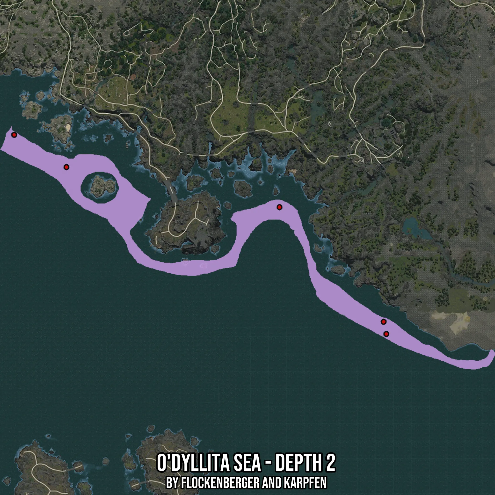

# O'dyllita Sea - Depth 2
Created by **flockenberger**

- **Red Points**: Exact in-game waypoints.
- **Colored Areas**: Entire area where the fishing table is consistent.
## ⚠️ Info about your float:
To verify your fishing position without modifying your files, you can do so [here](https://flockenberger.github.io/bdo-fish-position/).
- Or watch the guide [here](https://youtu.be/t-VXcRoNojk)

## Waypoints
Below you'll find the Copy-Paste ready XML file for this Fishing-Zone.

```xml
	<!--
		Waypoints for: O'dyllita Sea - Depth 2
		Auto-Generated by: flockenberger
		Preview at: https://github.com/Flockenberger/bdo-fish-waypoints/tree/main/Bookmark/O'dyllita%20Sea%20-%20Depth%202
	-->
	<WorldmapBookMark>
		<BookMark BookMarkName="1: O'dyllita Sea - Depth 2" PosX="-151491.72761440277" PosY="-8175.0" PosZ="-733364.7602796555" />
		<BookMark BookMarkName="2: O'dyllita Sea - Depth 2" PosX="-372555.26134967804" PosY="-8175.0" PosZ="-618014.1697883606" />
		<BookMark BookMarkName="3: O'dyllita Sea - Depth 2" PosX="-408696.43852710724" PosY="-8175.0" PosZ="-595727.1105289459" />
		<BookMark BookMarkName="4: O'dyllita Sea - Depth 2" PosX="-225279.96435165405" PosY="-8175.0" PosZ="-645722.4056243896" />
		<BookMark BookMarkName="5: O'dyllita Sea - Depth 2" PosX="-153298.78647327423" PosY="-8175.0" PosZ="-724931.8189382553" />
	</WorldmapBookMark>
```

## Usage Guide
[](https://youtu.be/W-bWmKdv8K8)

## Previews
     

 