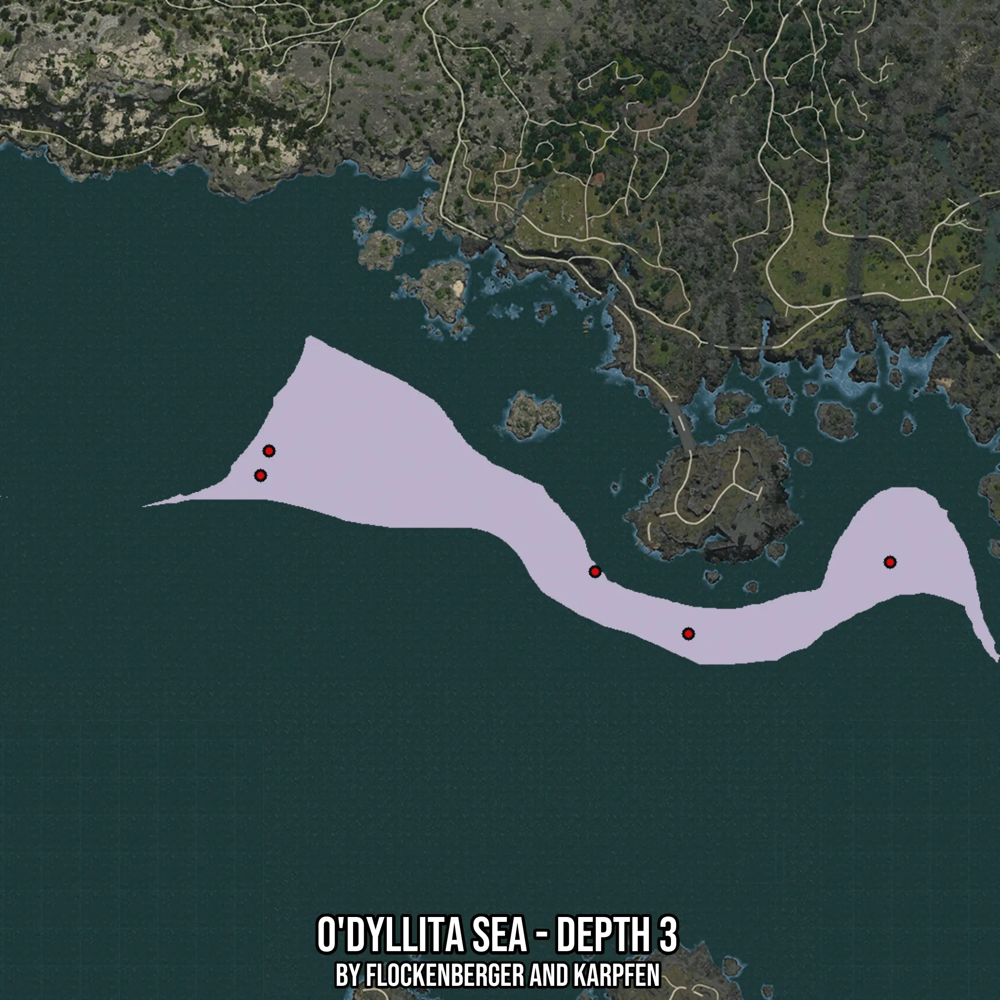

# O'dyllita Sea - Depth 3
Created by **flockenberger**

- **Red Points**: Exact in-game waypoints.
- **Colored Areas**: Entire area where the fishing table is consistent.
## ⚠️ Info about your float:
To verify your fishing position without modifying your files, you can do so [here](https://flockenberger.github.io/bdo-fish-position/).
- Or watch the guide [here](https://youtu.be/t-VXcRoNojk)

## Waypoints
Below you'll find the Copy-Paste ready XML file for this Fishing-Zone.

```xml
	<!--
		Waypoints for: O'dyllita Sea - Depth 3
		Auto-Generated by: flockenberger
		Preview at: https://github.com/Flockenberger/bdo-fish-waypoints/tree/main/Bookmark/O'dyllita%20Sea%20-%20Depth%203
	-->
	<WorldmapBookMark>
		<BookMark BookMarkName="1: O'dyllita Sea - Depth 3" PosX="-297863.495182991" PosY="-8175.0" PosZ="-701138.8772964478" />
		<BookMark BookMarkName="2: O'dyllita Sea - Depth 3" PosX="-434597.61550426483" PosY="-8175.0" PosZ="-650541.2292480469" />
		<BookMark BookMarkName="3: O'dyllita Sea - Depth 3" PosX="-327679.9663543701" PosY="-8175.0" PosZ="-681261.2298488617" />
		<BookMark BookMarkName="4: O'dyllita Sea - Depth 3" PosX="-431887.02721595764" PosY="-8175.0" PosZ="-642710.6408596039" />
		<BookMark BookMarkName="5: O'dyllita Sea - Depth 3" PosX="-233411.72921657562" PosY="-8175.0" PosZ="-678249.4650840759" />
	</WorldmapBookMark>
```

## Usage Guide
[](https://youtu.be/W-bWmKdv8K8)

## Previews
     

 