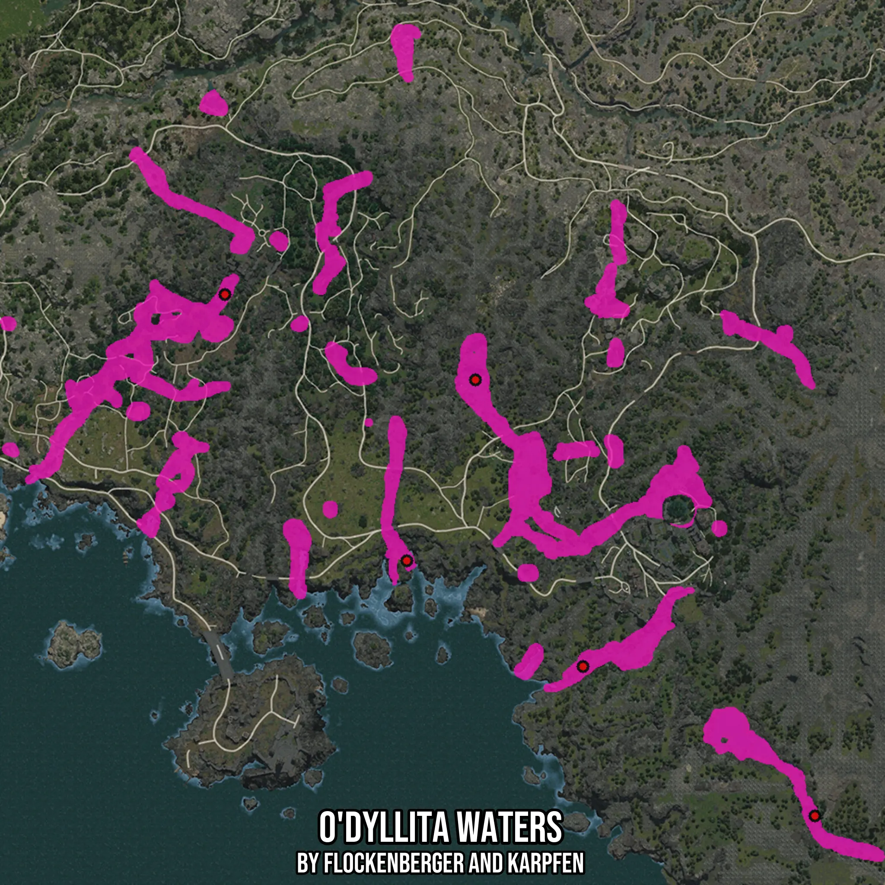

# O'dyllita Waters
Created by **flockenberger**

- **Red Points**: Exact in-game waypoints.
- **Colored Areas**: Entire area where the fishing table is consistent.
## ⚠️ Info about your float:
To verify your fishing position without modifying your files, you can do so [here](https://flockenberger.github.io/bdo-fish-position/).
- Or watch the guide [here](https://youtu.be/t-VXcRoNojk)

## Waypoints
Below you'll find the Copy-Paste ready XML file for this Fishing-Zone.

```xml
	<!--
		Waypoints for: O'dyllita Waters
		Auto-Generated by: flockenberger
		Preview at: https://github.com/Flockenberger/bdo-fish-waypoints/tree/main/Bookmark/O'dyllita%20Waters
	-->
	<WorldmapBookMark>
		<BookMark BookMarkName="1: O'dyllita Waters" PosX="-217148.19948673248" PosY="0.0" PosZ="-545430.6389570236" />
		<BookMark BookMarkName="2: O'dyllita Waters" PosX="-298465.8481359482" PosY="0.0" PosZ="-517722.40312099457" />
		<BookMark BookMarkName="3: O'dyllita Waters" PosX="-106917.60909557343" PosY="0.0" PosZ="-686983.5829019547" />
		<BookMark BookMarkName="4: O'dyllita Waters" PosX="-182211.7282152176" PosY="0.0" PosZ="-638494.1701889038" />
		<BookMark BookMarkName="5: O'dyllita Waters" PosX="-239435.25874614716" PosY="0.0" PosZ="-604160.0518703461" />
	</WorldmapBookMark>
```

## Usage Guide
[](https://youtu.be/W-bWmKdv8K8)

## Previews
     

 