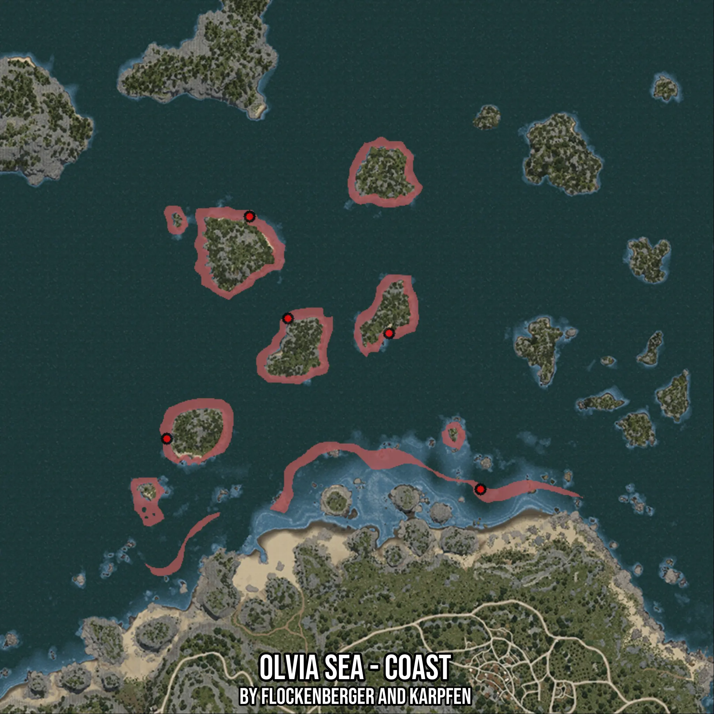

# Olvia Sea - Coast
Created by **flockenberger**

- **Red Points**: Exact in-game waypoints.
- **Colored Areas**: Entire area where the fishing table is consistent.
## ⚠️ Info about your float:
To verify your fishing position without modifying your files, you can do so [here](https://flockenberger.github.io/bdo-fish-position/).
- Or watch the guide [here](https://youtu.be/t-VXcRoNojk)

## Waypoints
Below you'll find the Copy-Paste ready XML file for this Fishing-Zone.

```xml
	<!--
		Waypoints for: Olvia Sea - Coast
		Auto-Generated by: flockenberger
		Preview at: https://github.com/Flockenberger/bdo-fish-waypoints/tree/main/Bookmark/Olvia%20Sea%20-%20Coast
	-->
	<WorldmapBookMark>
		<BookMark BookMarkName="1: Olvia Sea - Coast" PosX="-150588.19818496704" PosY="-8175.0" PosZ="187331.7283153534" />
		<BookMark BookMarkName="2: Olvia Sea - Coast" PosX="-230399.96445178986" PosY="-8175.0" PosZ="281599.9654531479" />
		<BookMark BookMarkName="3: Olvia Sea - Coast" PosX="-217148.19948673248" PosY="-8175.0" PosZ="246362.31770515442" />
		<BookMark BookMarkName="4: Olvia Sea - Coast" PosX="-259011.72971725464" PosY="-8175.0" PosZ="204799.96395111084" />
		<BookMark BookMarkName="5: Olvia Sea - Coast" PosX="-182211.7282152176" PosY="-8175.0" PosZ="241242.31760501862" />
	</WorldmapBookMark>
```

## Usage Guide
[](https://youtu.be/W-bWmKdv8K8)

## Previews
     

 