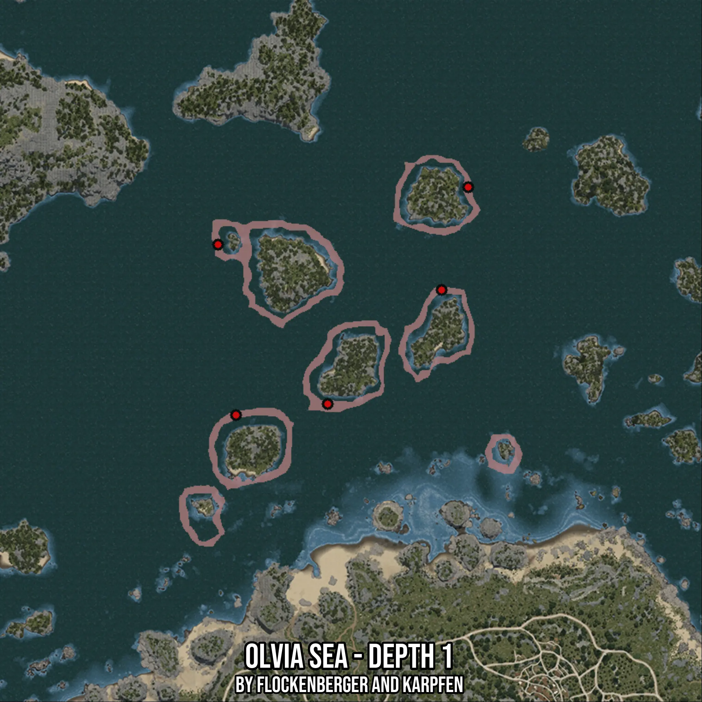

# Olvia Sea - Depth 1
Created by **flockenberger**

- **Red Points**: Exact in-game waypoints.
- **Colored Areas**: Entire area where the fishing table is consistent.
## ⚠️ Info about your float:
To verify your fishing position without modifying your files, you can do so [here](https://flockenberger.github.io/bdo-fish-position/).
- Or watch the guide [here](https://youtu.be/t-VXcRoNojk)

## Waypoints
Below you'll find the Copy-Paste ready XML file for this Fishing-Zone.

```xml
	<!--
		Waypoints for: Olvia Sea - Depth 1
		Auto-Generated by: flockenberger
		Preview at: https://github.com/Flockenberger/bdo-fish-waypoints/tree/main/Bookmark/Olvia%20Sea%20-%20Depth%201
	-->
	<WorldmapBookMark>
		<BookMark BookMarkName="1: Olvia Sea - Depth 1" PosX="-260216.43562316895" PosY="-8175.0" PosZ="278889.3771648407" />
		<BookMark BookMarkName="2: Olvia Sea - Depth 1" PosX="-221665.84663391113" PosY="-8175.0" PosZ="222870.55253982544" />
		<BookMark BookMarkName="3: Olvia Sea - Depth 1" PosX="-253891.72961711884" PosY="-8175.0" PosZ="218955.25834560394" />
		<BookMark BookMarkName="4: Olvia Sea - Depth 1" PosX="-181609.37526226044" PosY="-8175.0" PosZ="262927.02391147614" />
		<BookMark BookMarkName="5: Olvia Sea - Depth 1" PosX="-172272.90449142456" PosY="-8175.0" PosZ="299068.20108890533" />
	</WorldmapBookMark>
```

## Usage Guide
[](https://youtu.be/W-bWmKdv8K8)

## Previews
     

 