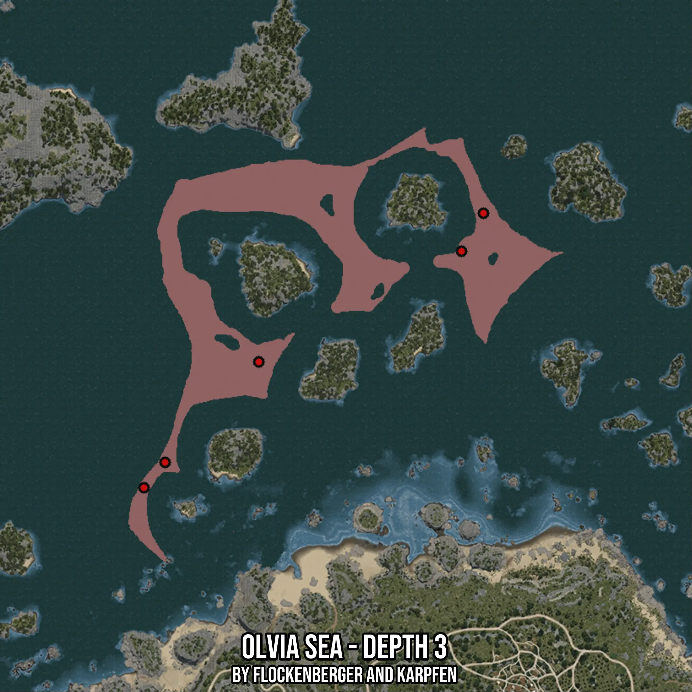

# Olvia Sea - Depth 3
Created by **flockenberger**

- **Red Points**: Exact in-game waypoints.
- **Colored Areas**: Entire area where the fishing table is consistent.
## ⚠️ Info about your float:
To verify your fishing position without modifying your files, you can do so [here](https://flockenberger.github.io/bdo-fish-position/).
- Or watch the guide [here](https://youtu.be/t-VXcRoNojk)

## Waypoints
Below you'll find the Copy-Paste ready XML file for this Fishing-Zone.

```xml
	<!--
		Waypoints for: Olvia Sea - Depth 3
		Auto-Generated by: flockenberger
		Preview at: https://github.com/Flockenberger/bdo-fish-waypoints/tree/main/Bookmark/Olvia%20Sea%20-%20Depth%203
	-->
	<WorldmapBookMark>
		<BookMark BookMarkName="1: Olvia Sea - Depth 3" PosX="-280395.2595472336" PosY="-8175.0" PosZ="194258.78727436066" />
		<BookMark BookMarkName="2: Olvia Sea - Depth 3" PosX="-239435.25874614716" PosY="-8175.0" PosZ="239134.08226966858" />
		<BookMark BookMarkName="3: Olvia Sea - Depth 3" PosX="-272865.84763526917" PosY="-8175.0" PosZ="203294.08156871796" />
		<BookMark BookMarkName="4: Olvia Sea - Depth 3" PosX="-167152.90439128876" PosY="-8175.0" PosZ="278588.2006883621" />
		<BookMark BookMarkName="5: Olvia Sea - Depth 3" PosX="-159322.31600284576" PosY="-8175.0" PosZ="292141.1421298981" />
	</WorldmapBookMark>
```

## Usage Guide
[](https://youtu.be/W-bWmKdv8K8)

## Previews
     

 