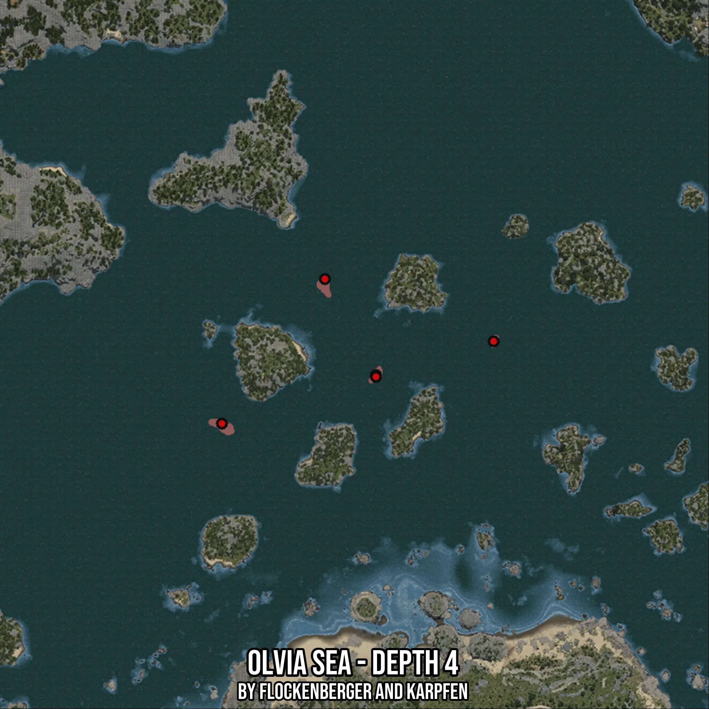

# Olvia Sea - Depth 4
Created by **flockenberger**

- **Red Points**: Exact in-game waypoints.
- **Colored Areas**: Entire area where the fishing table is consistent.
## ⚠️ Info about your float:
To verify your fishing position without modifying your files, you can do so [here](https://flockenberger.github.io/bdo-fish-position/).
- Or watch the guide [here](https://youtu.be/t-VXcRoNojk)

## Waypoints
Below you'll find the Copy-Paste ready XML file for this Fishing-Zone.

```xml
	<!--
		Waypoints for: Olvia Sea - Depth 4
		Auto-Generated by: flockenberger
		Preview at: https://github.com/Flockenberger/bdo-fish-waypoints/tree/main/Bookmark/Olvia%20Sea%20-%20Depth%204
	-->
	<WorldmapBookMark>
		<BookMark BookMarkName="1: Olvia Sea - Depth 4" PosX="-250578.7883758545" PosY="-8175.0" PosZ="247265.84713459015" />
		<BookMark BookMarkName="2: Olvia Sea - Depth 4" PosX="-214738.78767490387" PosY="-8175.0" PosZ="297562.31870651245" />
		<BookMark BookMarkName="3: Olvia Sea - Depth 4" PosX="-196969.37556266785" PosY="-8175.0" PosZ="264131.72981739044" />
		<BookMark BookMarkName="4: Olvia Sea - Depth 4" PosX="-156009.37476158142" PosY="-8175.0" PosZ="275877.61240005493" />
		<BookMark BookMarkName="5: Olvia Sea - Depth 4" PosX="-196969.37556266785" PosY="-8175.0" PosZ="263529.3768644333" />
	</WorldmapBookMark>
```

## Usage Guide
[](https://youtu.be/W-bWmKdv8K8)

## Previews
     

 